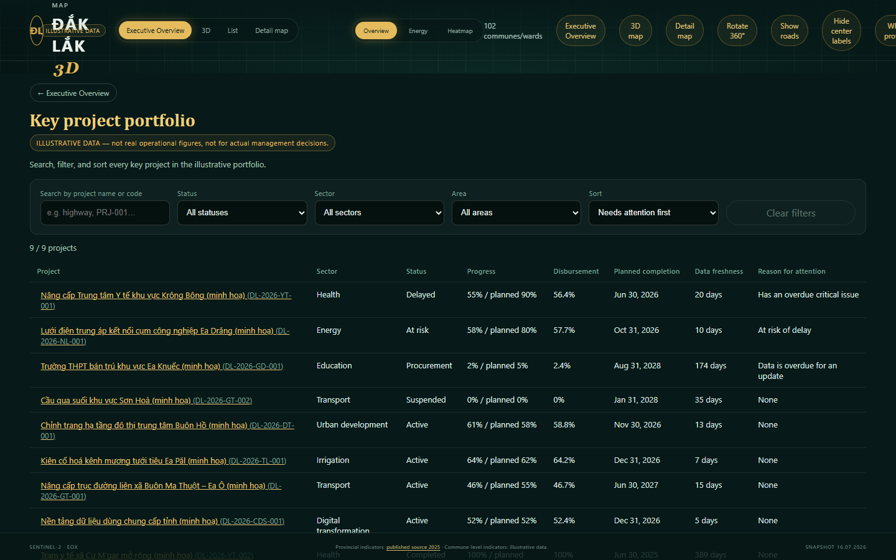
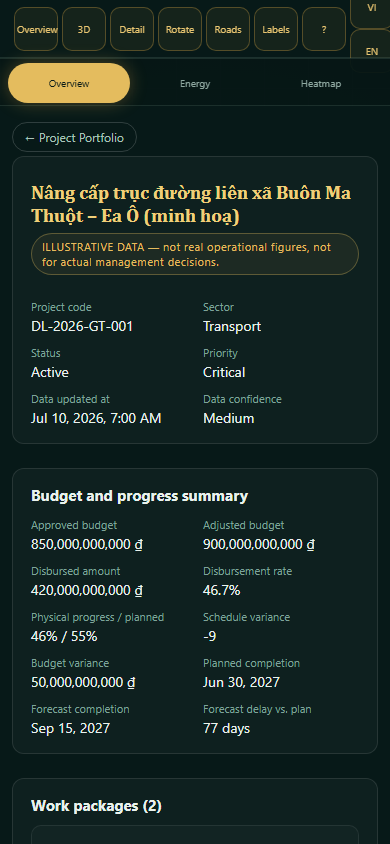
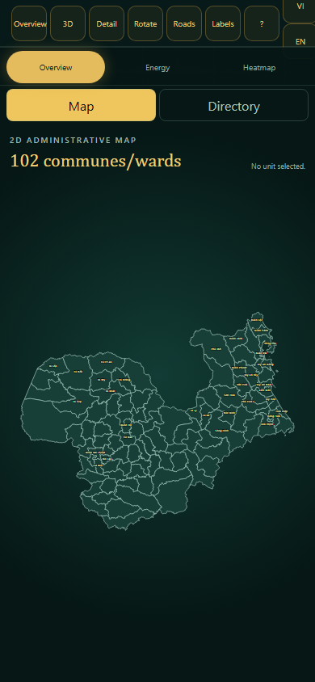
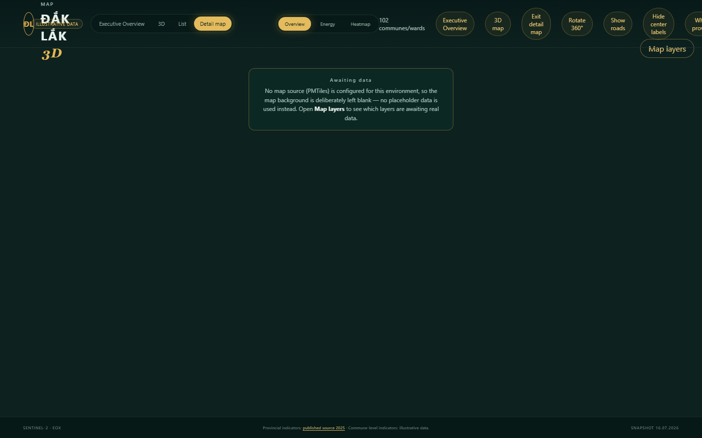

# Đắk Lắk 3D Dashboard

[](https://github.com/shadowhunter67/daklak-3d-dashboard/actions/workflows/quality.yml)
[](https://github.com/shadowhunter67/daklak-3d-dashboard/actions/workflows/deploy-pages.yml)
[](LICENSE)

[Tiếng Việt](README.md) (primary, most complete) · **English** (this file — a summary, not a full translation)

A WebGL dashboard for the 102 communes/wards of Đắk Lắk province after the 2025 administrative
merger, from the former Đắk Lắk highlands to the former Phú Yên coast. The map uses an SRTM
displacement terrain surface with Sentinel-2 imagery and polygon hit-testing for hover/click/
selection. Four experiences: **Executive Overview** (default landing — portfolio KPIs, projects
needing attention, alerts, data health), the 3D overview, an accessible 2D list, and a detail map
(`?view=map`) using **MapLibre GL JS + self-hosted PMTiles** — no Google Maps Platform dependency,
no API key or billing required.

The project is transitioning from a "3D map dashboard" toward a "provincial key-project executive
platform that uses the map as a contextual layer" — see [ADR 0001](docs/adr/0001-project-centric-domain.md)
and the [domain model](docs/domain-model.md). Executive Overview, Project Portfolio, and Project
Detail currently use **deterministic illustrative data** for 9 sample projects, not real
operational figures.

## Demo

**Live demo:** https://shadowhunter67.github.io/daklak-3d-dashboard/

> **Disclaimer:** all project/work-package/milestone/budget/disbursement/issue data shown in
> Executive Overview and the map experiences is **deterministic illustrative data** (a fixed seed
> in the source code), not real operational or official government figures — it is not for actual
> management decisions, approvals, or reporting. The map is a reference visualization, not a legal
> record for land, surveying, planning, or administrative boundary purposes.

## Language / Internationalization

The UI supports **Vietnamese** (default) and **English**, switchable via the "VI / EN" control at
the top-right of the header — no page reload. The choice is reflected in a shareable URL
(`?lang=vi`/`?lang=en`, composable with any `?view=`/`#/projects...`) and remembered via
`localStorage`; Back/Forward correctly undoes/redoes the most recent language switch. See
[ADR 0003](docs/adr/0003-internationalization.md) for the full design.

**Currently translated:** the entire product — app shell, header, Executive Overview, Project
Portfolio, Project Detail, the 3D map controls, the accessible 2D directory, the MapLibre detail
map (layer panel, base map selector, local search, distance measurement), the onboarding tour, the
Data Sources panel, and the data provenance/quality dialog. A static audit
(`scripts/check_i18n_hardcoded_strings.mjs`, run in `npm test`) fails the build if any hard-coded
Vietnamese UI string appears outside the translation dictionary, so this can't silently regress.

**Deliberately still Vietnamese-only, by design, never a bug:** proper nouns (place names, project
names/codes from the illustrative fixture data), and any third-party/source content that has no
English variant yet (e.g. a dataset's `title`/`description` sourced from a Vietnamese-only
publisher document — see `resolveLocalizedText` in `src/i18n/`, which shows a small "Vietnamese
source text" note in that case rather than a broken or half-translated sentence).

## Screenshot

<p align="center">
  
</p>
<p align="center">
  
</p>
<p align="center">
  
  
</p>
<p align="center">
  
</p>
<p align="center"><sub>Every other screenshot in <a href="README.md">README.md</a> is in Vietnamese, the app's default language — these five show the same views switched to English.</sub></p>

## Running the project

Requires Node.js 22. GIS artifacts are already committed, so a frontend-only contributor does not
need Python:

```bash
npm ci
npm run dev
```

Full quality gate (lint, format, typecheck, unit tests, build, budget, production E2E, plus Python
GIS validation):

```bash
npm run quality
```

See [README.md](README.md#chạy-dự-án) for the complete command reference, GIS rebuild instructions,
and output artifact list — they are not duplicated here to avoid the two files drifting apart.

## Licensing

This repository is **public but not open source**. Starting from the commit right after the
[`mit-final-1.0.0`](https://github.com/shadowhunter67/daklak-3d-dashboard/releases/tag/mit-final-1.0.0)
tag, the source is released under a **Source-Available Evaluation License** (see [LICENSE](LICENSE)):
viewing, cloning, local evaluation, learning, and non-commercial testing are permitted; commercial
use, production deployment, hosting as a service, resale, sublicensing, white-labeling, use in paid
client work, building a competing product, or redistribution are **not** — a separate written
commercial agreement is required (see [COMMERCIAL-LICENSE.md](COMMERCIAL-LICENSE.md)).

Every commit at or before `mit-final-1.0.0` remains under the MIT License it was released under —
this transition is not retroactive (see [LICENSE-HISTORY.md](LICENSE-HISTORY.md)). Third-party
dependencies and data (OpenStreetMap, Sentinel-2, SRTM, `vietnamese-provinces-database`, ...) keep
their own licenses regardless of this project's license — see
[THIRD_PARTY_NOTICES.md](THIRD_PARTY_NOTICES.md) and [ATTRIBUTION.md](ATTRIBUTION.md). This license
text has not been reviewed by a lawyer — see the notice in [LICENSE](LICENSE) before relying on it
for an actual commercial transaction.

## Technical documentation

See the [Tài liệu kỹ thuật](README.md#tài-liệu-kỹ-thuật) section of the Vietnamese README for the
full list of architecture, testing, performance, accessibility, data-platform, and ADR documents —
maintained in one place to avoid duplication/drift between the two READMEs.
