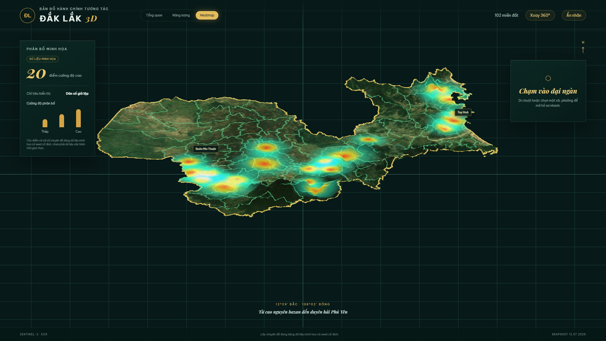

# Đắk Lắk 3D Dashboard

Dashboard WebGL thể hiện 102 xã/phường của tỉnh Đắk Lắk sau sắp xếp năm 2025, từ cao nguyên Đắk Lắk cũ đến duyên hải Phú Yên cũ. Mỗi đơn vị là một mesh tương tác độc lập với hover, click, selected state, tooltip hồ sơ, nhãn và số liệu minh họa.

## Demo

[](https://shadowhunter67.github.io/daklak-3d-dashboard/)

**Live demo:** https://shadowhunter67.github.io/daklak-3d-dashboard/

> **Disclaimer:** sản phẩm trực quan tham khảo, không dùng cho đất đai, đo đạc, quy hoạch pháp lý hoặc xác lập địa giới chính thức. Số liệu dashboard là mock data deterministic, không phải thống kê nhà nước.

## Stack và kiến trúc

React 19, TypeScript strict, Vite, Three.js/React Three Fiber, Drei, D3 Geo, Zustand và ECharts. GIS được xử lý offline bằng GeoPandas/Shapely/PyProj/Fiona; trình duyệt chỉ parse file tĩnh và dựng geometry.

Luồng dữ liệu: snapshot MIT → chuẩn hóa/repair EPSG:4326 → GeoJSON + outline + borders + labels + metadata → D3 projection → Three.js ExtrudeGeometry → state/store → dashboard.

## Chạy dự án

Yêu cầu Node.js 20+ và Python 3.11+.

```bash
npm install
python -m pip install -r scripts/requirements.txt
npm run build:gis
npm run build:terrain
npm run validate:data
npm run dev
```

Build production và quality gates:

```bash
npm run lint
npm run format:check
npm run typecheck
npm test
npm run build
```

## Xây lại GIS

Clone `thanglequoc/vietnamese-provinces-database` ngang project vào `../references/`, checkout snapshot ghi trong `daklak-source-summary.json`, rồi chạy `npm run build:gis`. Pipeline sinh các file tại `src/assets/maps/daklak/` và báo cáo tại `reports/`. `daklak-label-overrides.json` dành cho điều chỉnh label thủ công; hiện chưa có override. Thay `daklak-metrics.json` bằng nguồn thống kê thật nhưng phải giữ khóa `code` và cập nhật attribution.

## Dữ liệu đầu ra

- `daklak-wards.geojson`: 102 geometry chuẩn; `daklak-wards.json` là bản byte-identical và `daklak-wards-render.json` là LOD nhẹ dành cho WebGL.
- `daklak-outline.geojson`, `daklak-borders.geojson`: dissolve và unique linework.
- `daklak-labels.json`, `daklak-label-overrides.json`: point-on-surface và override.
- `daklak-terrain-height.png`, `normal.png`, `color.png`, `mask.png`: terrain SRTM dẫn xuất cho displacement mesh.
- `daklak-metadata.json`, `daklak-source-summary.json`, `daklak-metrics.json`.
- `reports/validation-report.json`: bằng chứng validation máy đọc được.

## Nguồn, bản quyền và tính nguyên bản

Tên/số lượng theo Nghị quyết 1660/NQ-UBTVQH15; mã theo Quyết định 19/2025/QĐ-TTg. Geometry từ `thanglequoc/vietnamese-provinces-database` (MIT). Xem [ATTRIBUTION.md](ATTRIBUTION.md), [THIRD_PARTY_NOTICES.md](THIRD_PARTY_NOTICES.md), [docs/reference-analysis.md](docs/reference-analysis.md) và [docs/originality-report.md](docs/originality-report.md).

## Giới hạn và roadmap

Geometry là dữ liệu mở tham khảo, chưa được cơ quan địa chính chứng nhận. Chưa có tile LOD, thống kê chính thức, kiểm thử trình duyệt đa thiết bị hoặc label collision solver động. Roadmap: Draco/TopoJSON, worker geometry cache, Playwright visual regression, nguồn thống kê có version và chế độ 2D accessible.
