# Đắk Lắk 3D Dashboard

[](https://github.com/shadowhunter67/daklak-3d-dashboard/actions/workflows/quality.yml)
[](https://github.com/shadowhunter67/daklak-3d-dashboard/actions/workflows/deploy-pages.yml)
[](LICENSE)

**Tiếng Việt** (chính) · [**English**](README.en.md)

Dashboard WebGL thể hiện 102 xã/phường của tỉnh Đắk Lắk sau sắp xếp năm 2025, từ cao nguyên Đắk Lắk cũ đến duyên hải Phú Yên cũ. Bản đồ sử dụng một bề mặt địa hình displacement từ SRTM, phủ ảnh Sentinel-2 và xác định đơn vị hành chính bằng hit-test polygon để hỗ trợ hover, click, selected state, hồ sơ nhanh và các lớp dữ liệu chuyên đề. Bốn trải nghiệm: **Tổng quan điều hành** (landing mặc định — KPI danh mục dự án, danh sách cần chú ý, cảnh báo, sức khỏe dữ liệu), tổng quan 3D, danh sách 2D accessible, và bản đồ chi tiết (`?view=map`) dùng **MapLibre GL JS + PMTiles tự host** — hoàn toàn không phụ thuộc Google Maps Platform, không cần API key hay billing. Xem [docs/detail-map-integration.md](docs/detail-map-integration.md).

Dự án đang chuyển dần từ "dashboard bản đồ 3D" sang "nền tảng điều hành dự án trọng điểm cấp tỉnh, dùng bản đồ làm lớp ngữ cảnh" — xem [ADR 0001](docs/adr/0001-project-centric-domain.md) và [domain model](docs/domain-model.md). Từ Phase 2B1, nền tảng có thêm **Danh mục dự án** (tìm kiếm/lọc/sắp xếp toàn bộ dự án) và **Chi tiết dự án** (trang riêng, đầy đủ ngân sách/tiến độ/gói thầu/mốc/vướng mắc/nguồn dữ liệu) với URL riêng dùng hash routing — xem [ADR 0002](docs/adr/0002-static-host-routing.md). Tổng quan điều hành, Danh mục dự án và Chi tiết dự án hiện tại đều dùng **dữ liệu minh họa deterministic** cho 9 dự án mẫu (`src/entities/project/illustrativeProjectPortfolio.ts`), không phải số liệu vận hành thật — xem mục "Giới hạn và roadmap" bên dưới.

## Demo

[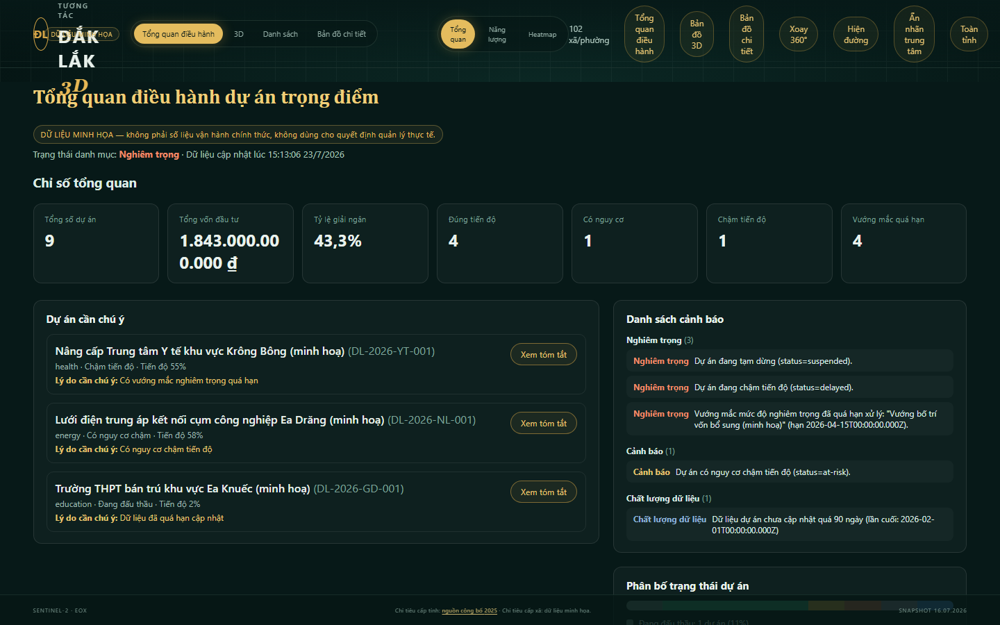](https://shadowhunter67.github.io/daklak-3d-dashboard/)

**Live demo:** https://shadowhunter67.github.io/daklak-3d-dashboard/

> **Disclaimer:** toàn bộ dữ liệu dự án/gói thầu/mốc tiến độ/ngân sách/giải ngân/tiến độ/vướng mắc hiển thị trong Tổng quan điều hành và các trải nghiệm bản đồ đều là **dữ liệu minh họa deterministic** (seed cố định trong mã nguồn), không phải số liệu vận hành hay số liệu chính thức của cơ quan nhà nước, không dùng cho quyết định quản lý, phê duyệt hoặc báo cáo thực tế. Bản đồ là sản phẩm trực quan tham khảo, không dùng cho đất đai, đo đạc, quy hoạch pháp lý hoặc xác lập địa giới chính thức.

## Ngôn ngữ

Giao diện hỗ trợ **tiếng Việt** (mặc định) và **tiếng Anh**, chuyển đổi bằng nút "VI / EN" ở góc phải header, không reload trang. URL chia sẻ được (`?lang=vi`/`?lang=en`, tương thích với mọi `?view=`/`#/projects...` khác), lựa chọn được nhớ qua `localStorage`, Back/Forward hoàn tác đúng lần chuyển ngôn ngữ gần nhất — xem [ADR 0003](docs/adr/0003-internationalization.md).

**Phạm vi dịch hiện tại:** app shell, header, và toàn bộ Tổng quan điều hành (KPI, dự án cần chú ý, cảnh báo, sức khỏe dữ liệu, hộp thoại tóm tắt). **Chưa dịch** (fallback đúng thiết kế về tiếng Việt, không lỗi): Danh mục dự án, Chi tiết dự án, bản đồ 3D/2D và bản đồ chi tiết — xem "Giới hạn và roadmap" và ADR 0003 mục "Phạm vi dịch trong PR này" để biết lý do và kế hoạch mở rộng.

English documentation: [README.en.md](README.en.md).

## Điều hướng

Bốn trải nghiệm loại trừ lẫn nhau, đồng bộ vào query string `?view=` (giá trị thật do `src/utils/dashboardUrl.ts` phát ra — xem `parseViewMode`/`serializeViewMode`):

| `?view=`                             | Trải nghiệm             | Ghi chú                                                                                                                       |
| ------------------------------------ | ----------------------- | ----------------------------------------------------------------------------------------------------------------------------- |
| _(không có tham số)_ hoặc `overview` | **Tổng quan điều hành** | Landing mặc định từ Phase 2A — KPI danh mục dự án, danh sách cần chú ý, cảnh báo, sức khỏe dữ liệu.                           |
| `3d`                                 | Tổng quan 3D            | Bản đồ WebGL displacement terrain, giữ nguyên hành vi trước Phase 2A.                                                         |
| `2d`                                 | Danh sách 2D accessible | Giá trị URL thực tế vẫn là `2d` (không phải `table`) dù kiểu `DashboardView` nội bộ gọi là `'table'` — xem `dashboardUrl.ts`. |
| `map`                                | Bản đồ chi tiết         | MapLibre GL JS + PMTiles tự host.                                                                                             |

Mọi URL `?view=3d` / `?view=2d` / `?view=map` từ trước Phase 2A vẫn hoạt động y hệt — chỉ việc thiếu tham số `view` (hoặc giá trị lạ) mới đổi hành vi, từ ngã về `3d` (trước Phase 2A) sang ngã về `overview` (từ Phase 2A). Xem [ADR 0001](docs/adr/0001-project-centric-domain.md).

### Danh mục dự án / Chi tiết dự án (Phase 2B1)

Hai điểm vào mới, **độc lập với `?view=`**, dùng hash routing (không cần server rewrite trên GitHub Pages — xem [ADR 0002](docs/adr/0002-static-host-routing.md)):

| URL                                                     | Trải nghiệm                                                                                                |
| ------------------------------------------------------- | ---------------------------------------------------------------------------------------------------------- |
| `#/projects`                                            | **Danh mục dự án** — tìm kiếm/lọc (trạng thái, lĩnh vực, địa bàn)/sắp xếp toàn bộ dự án trong danh mục.    |
| `#/projects?status=delayed&sector=transport&q=…&sort=…` | Cùng trang, với bộ lọc đã đồng bộ vào URL (chia sẻ được, tồn tại qua reload/Back-Forward).                 |
| `#/projects/:projectId`                                 | **Chi tiết dự án** — ngân sách, tiến độ, gói thầu, mốc, lịch sử tiến độ, vướng mắc, vị trí, nguồn dữ liệu. |

Một route dự án (khi có mặt trong `location.hash`) luôn được ưu tiên render trên 4 trải nghiệm `?view=` — ví dụ `?view=3d#/projects` vẫn mở Danh mục dự án, không mở bản đồ 3D. Trực tiếp mở/reload/Back-Forward trên cả hai URL đều hoạt động đúng vì hash routing không cần server biết trước route nào tồn tại. Mở từ nút "Xem danh mục dự án →" trên Tổng quan điều hành, hoặc dán thẳng URL.

## Screenshots

<p align="center">
  
  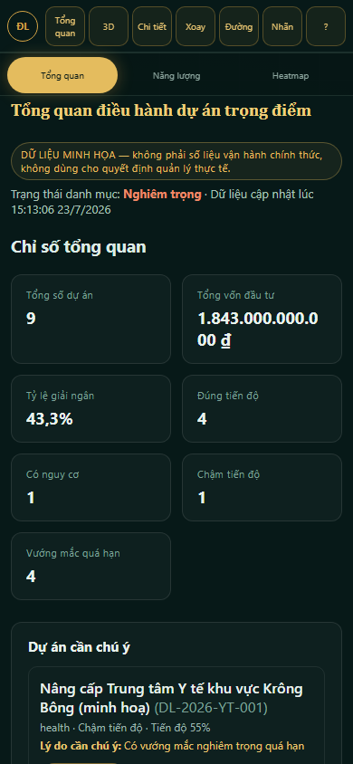
</p>
<p align="center"><sub><b>Trái:</b> Tổng quan điều hành trên desktop — landing mặc định từ Phase 2A. <b>Phải:</b> cùng trải nghiệm trên khung hình mobile.</sub></p>

<p align="center">
  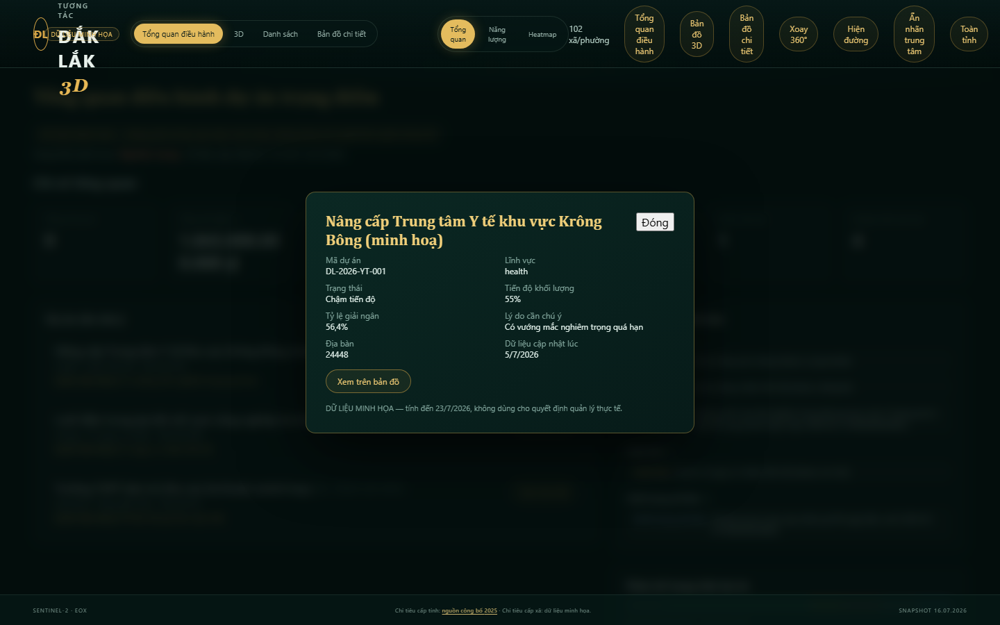
</p>
<p align="center"><sub>Hộp thoại tóm tắt một dự án (mở từ "Xem tóm tắt" trong danh sách "Dự án cần chú ý"), đóng bằng Escape hoặc nút "Đóng" và trả focus đúng về nút đã mở nó.</sub></p>

<p align="center">
  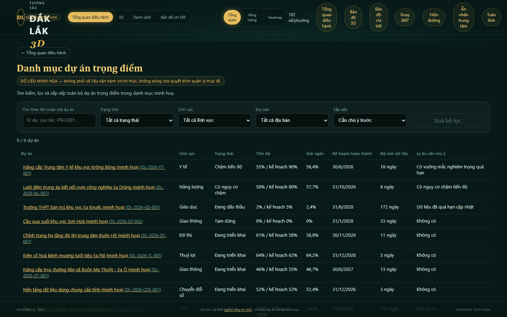
  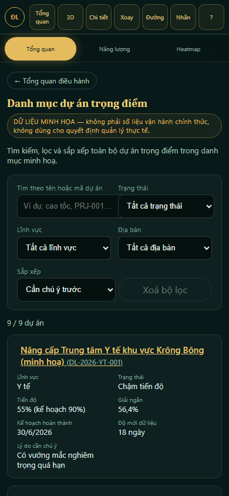
</p>
<p align="center"><sub><b>Trái:</b> Danh mục dự án (<code>#/projects</code>) trên desktop — bảng có ngữ nghĩa <code>&lt;table&gt;</code> đầy đủ. <b>Phải:</b> cùng trải nghiệm trên mobile, tự chuyển sang thẻ để không phải cuộn ngang.</sub></p>

<p align="center">
  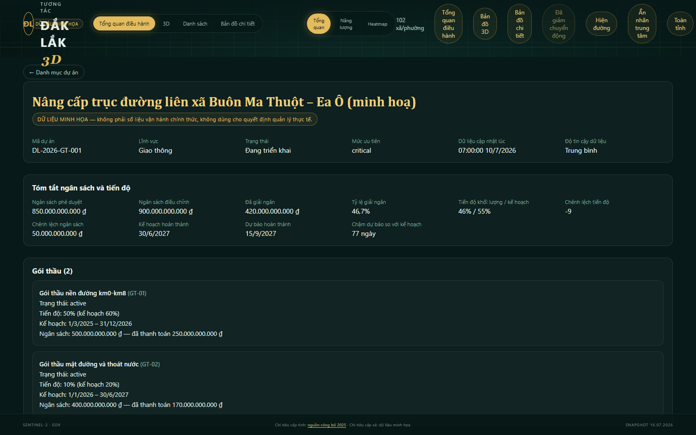
  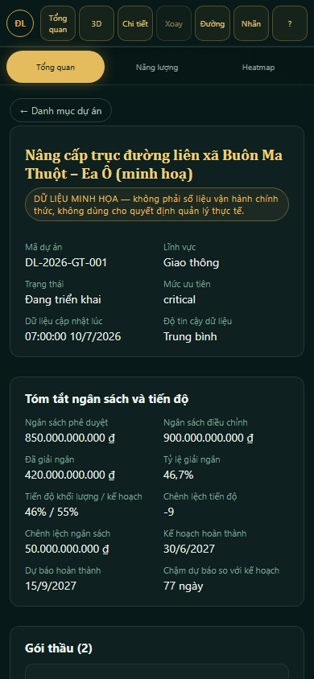
</p>
<p align="center"><sub><b>Trái:</b> Chi tiết dự án (<code>#/projects/:id</code>) trên desktop — trang riêng có URL, không phải modal. <b>Phải:</b> cùng trải nghiệm trên mobile.</sub></p>

<p align="center">
  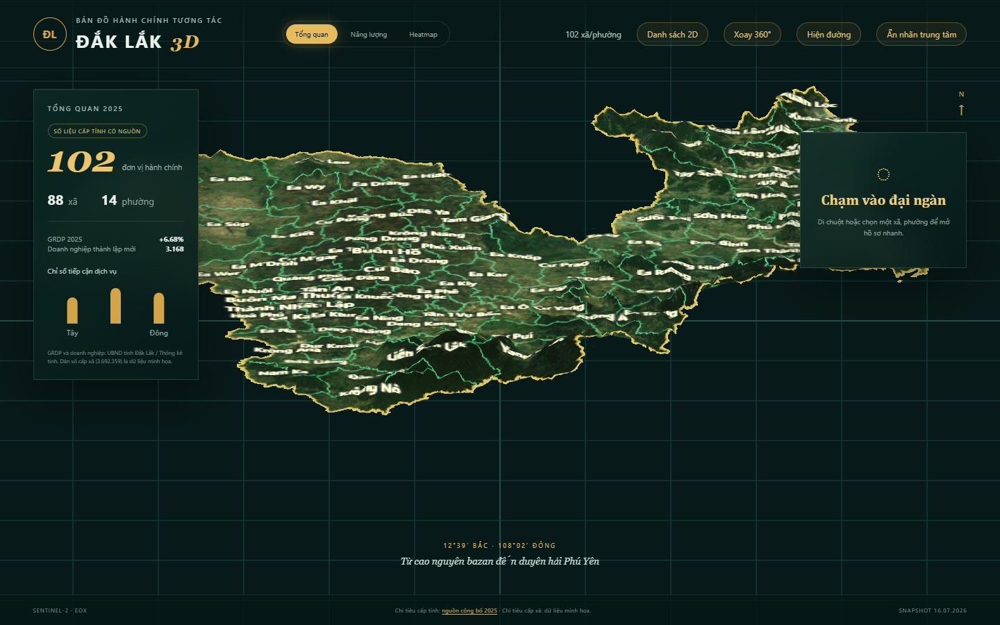
  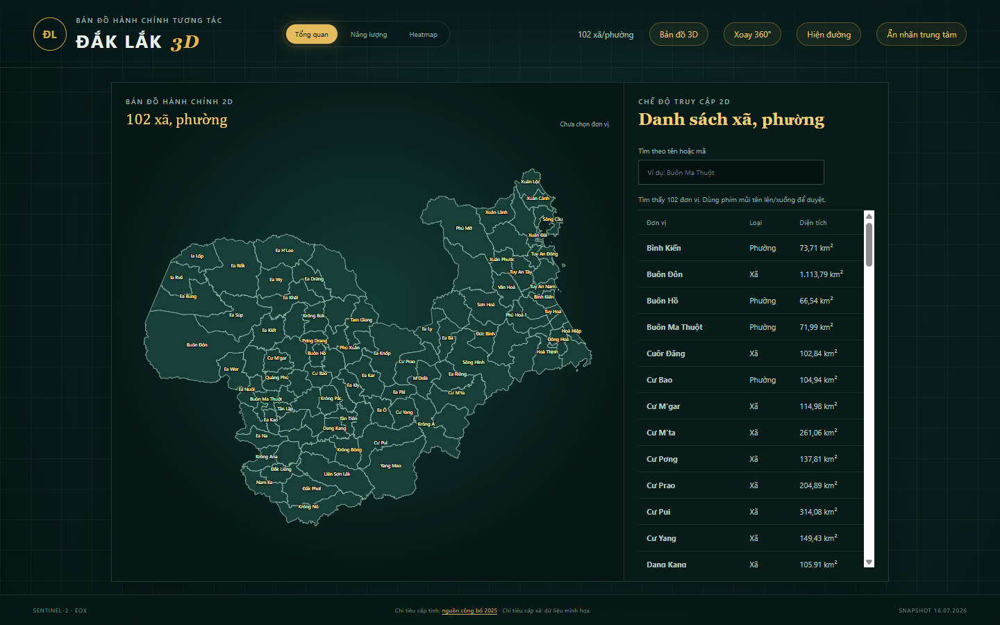
</p>
<p align="center"><sub><b>Trái:</b> bản đồ 3D, chế độ Tổng quan, với nhãn hành chính trên địa hình. <b>Phải:</b> bản đồ 2D với nhãn xã/phường thích ứng theo không gian hiển thị, danh sách tra cứu không che bản đồ.</sub></p>

<p align="center">
  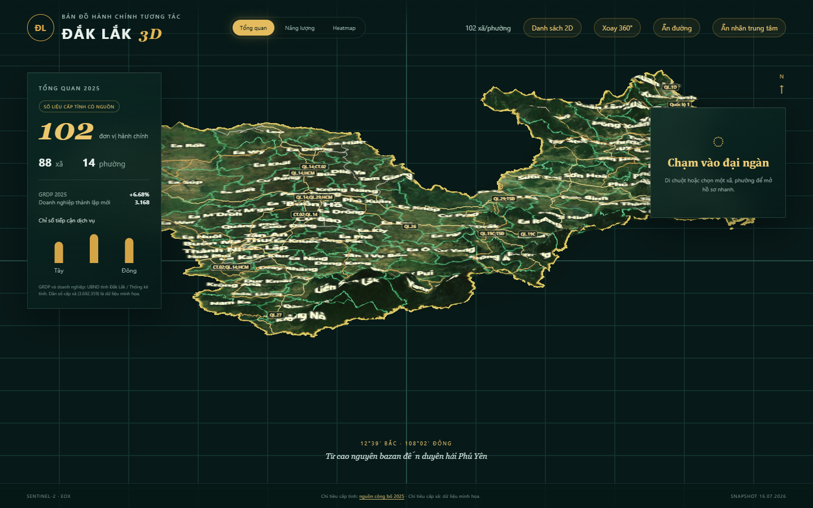
  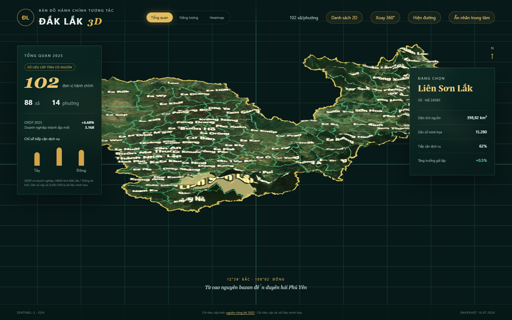
</p>
<p align="center"><sub><b>Trái:</b> lớp đường giao thông (OpenStreetMap, ODbL 1.0) cùng nhãn tuyến đường trên bản đồ 3D. <b>Phải:</b> hồ sơ nhanh khi chọn một xã/phường (ví dụ Liên Sơn Lắk, mã 24580).</sub></p>

<p align="center">
  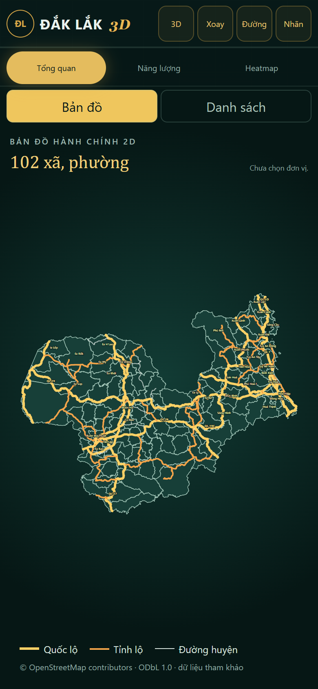
  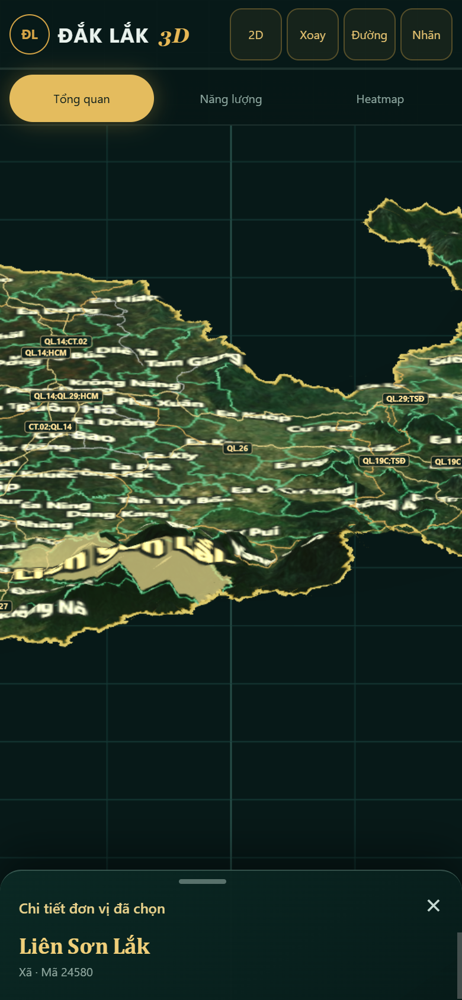
</p>
<p align="center"><sub><b>Trái:</b> bản đồ 2D và lớp đường giao thông trên giao diện mobile. <b>Phải:</b> bottom sheet chọn nhanh trên giao diện mobile.</sub></p>

<p align="center">
  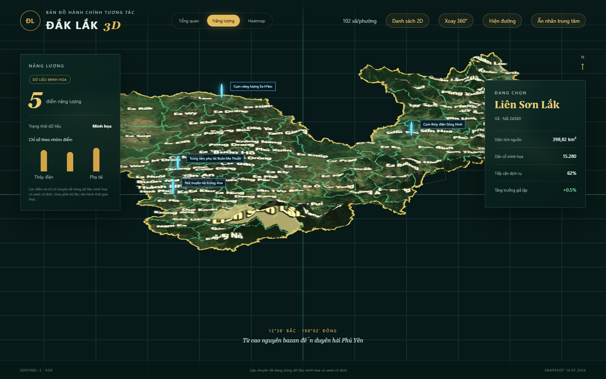
  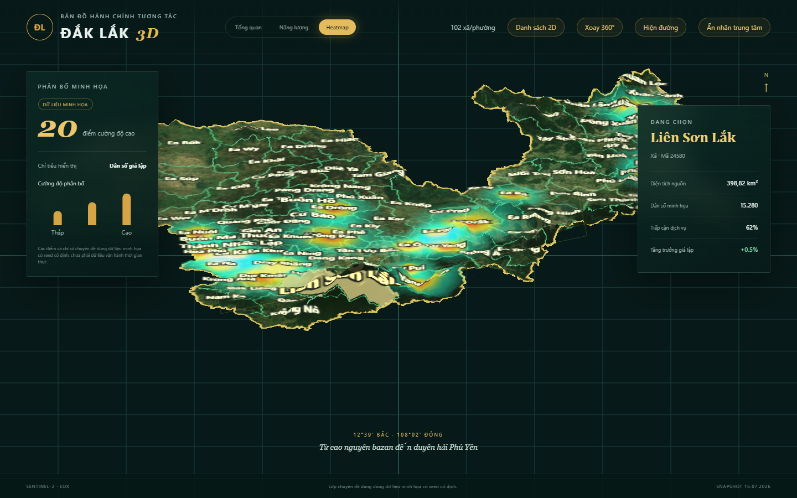
</p>
<p align="center"><sub><b>Trái:</b> chế độ Năng lượng với các điểm thủy điện, phụ tải minh họa. <b>Phải:</b> chế độ Heatmap thể hiện phân bố dân số giả lập theo cường độ màu.</sub></p>

<p align="center">
  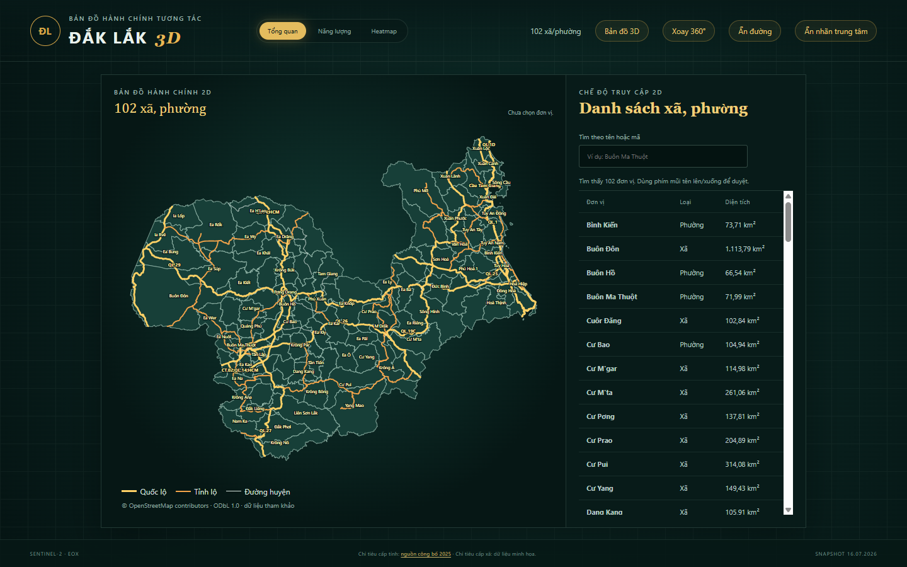
  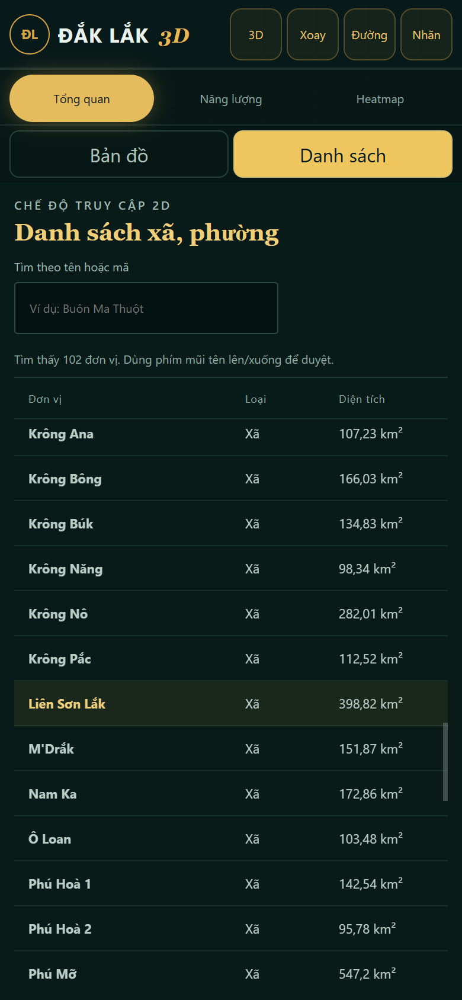
</p>
<p align="center"><sub><b>Trái:</b> bản đồ 2D với lớp đường giao thông và danh sách tra cứu. <b>Phải:</b> danh sách xã/phường trên giao diện mobile, đồng bộ với đơn vị đang chọn.</sub></p>

> Dữ liệu cấp xã và các lớp chuyên đề (dân số, năng lượng, heatmap) là **dữ liệu minh họa** có seed cố định, không phải số liệu vận hành thời gian thực. Lớp đường giao thông lấy từ **OpenStreetMap, giấy phép ODbL 1.0**. Bản đồ không phải hồ sơ hành chính hoặc tài liệu pháp lý chính thức — geometry là dữ liệu mở tham khảo, chưa được cơ quan địa chính chứng nhận.

## Stack và kiến trúc

React 19, TypeScript strict, Vite, Three.js/React Three Fiber, Drei, D3 Geo, Zustand, MapLibre GL JS và PMTiles. GIS được xử lý offline bằng GeoPandas/Shapely/PyProj/Fiona; trình duyệt chỉ parse file tĩnh và dựng geometry. `maplibre-gl`/`pmtiles` chỉ tải khi mở bản đồ chi tiết (lazy chunk riêng, không nằm trong initial bundle hay bundle của tổng quan 3D). Các biểu đồ cột nhỏ (`StatPanel`) là SVG/CSS thuần, không dùng thư viện chart riêng. Song ngữ (`src/i18n/`) tự viết — Context + dictionary object, không dùng `react-i18next`; dictionary tiếng Anh lazy-load qua `import()`, không nằm trong bundle ban đầu — xem [ADR 0003](docs/adr/0003-internationalization.md).

Luồng dữ liệu: snapshot MIT → chuẩn hóa/repair EPSG:4326 → GeoJSON + outline + borders + labels + metadata → DEM/ảnh bề mặt tiền xử lý → D3 projection → Three.js displacement terrain → polygon hit-test + Zustand → dashboard.

Phần bản đồ được tách theo trách nhiệm: bề mặt terrain, các overlay heatmap/selection, nhãn và điểm năng lượng, camera controls, cấu hình terrain và hit-test hình học. Hover được giới hạn theo animation frame và lọc bounding box trước khi chạy point-in-polygon.

Tổng quan điều hành đi theo một luồng riêng, tách biệt hoàn toàn khỏi phần bản đồ:

`BundledProjectPortfolioSource` (`src/data/`) → domain validation/assessment (`src/entities/project/`) → read model Tổng quan điều hành (`buildExecutiveOverview`, `src/features/executive-overview/model/`) → component trình bày (`ExecutiveOverview`, `KpiCardGrid`, `PriorityProjectList`, `AlertList`, `DataHealthPanel`, …)

Component trình bày không tự tính KPI/cảnh báo — mọi con số đều đọc từ `ExecutiveOverviewModel` do `buildExecutiveOverview` tạo ra trên domain layer đã validate. Xem [docs/architecture.md](docs/architecture.md) và [docs/domain-model.md](docs/domain-model.md) để biết chi tiết ranh giới import (domain layer không được import GIS/UI/Zustand).

## Chạy dự án

Yêu cầu Node.js 22. Các artifact GIS đã được commit, vì vậy developer chỉ sửa frontend không cần cài Python hoặc xây lại dữ liệu:

```bash
npm ci
npm run dev
```

Python 3.12 chỉ cần khi kiểm định hoặc tái tạo GIS. Xem phần **Xây lại GIS** và `scripts/README.md`; `.nvmrc` và `.python-version` khớp với CI.

Build production và quality gates:

```bash
npm run lint
npm run format:check
npm run typecheck
npm test
npx playwright install chromium
npm run test:e2e
npm run build
npm run check:budget
```

Playwright chạy smoke test trên Chromium desktop, Chromium mobile (Pixel 7) và WebKit desktop (Desktop Safari). Visual regression chỉ dùng Chromium desktop/mobile để tránh nhiễu rasterization giữa engine. CI không tự bootstrap baseline còn thiếu — PR thiếu hoặc lệch baseline sẽ fail rõ ràng. Chỉ cập nhật baseline có chủ đích qua workflow thủ công **Visual baseline (manual)** (`workflow_dispatch`) hoặc `npm run test:e2e:update` cục bộ, xem [chi tiết](docs/testing-strategy.md#updating-a-visual-baseline-on-purpose).

Hoặc chạy toàn bộ bằng `npm run quality:frontend` (lint, format, typecheck, unit test, build, budget, build metrics, E2E production — không cần Python/GIS) khi chỉ sửa frontend. Dùng `npm run quality:full` (hoặc alias `npm run quality`, giữ để không phá thói quen/CI hiện tại) khi cần thêm bước `validate:data` bằng Python. `npm run check:gis-deps` báo rõ nếu thiếu Python hoặc các gói GIS (`scripts/requirements.txt`) trước khi validate:data chạy. Ngân sách build được lưu tại `reports/performance-budget.json` và chặn tăng trưởng ngoài ý muốn của JavaScript/texture trong CI.

Dashboard đồng bộ `view`, `mode` và `ward` vào query string để URL có thể chia sẻ, refresh và dùng Back/Forward mà không cần router. `npm run build:metrics` sinh [JSON](reports/build-metrics.json) và [bảng Markdown](reports/build-metrics.md) từ build thật; FPS, GPU memory và LCP không được tuyên bố vì CI không đại diện cho GPU thiết bị thật.

Mỗi production build sinh `dist/build-info.json` gồm version ứng dụng, commit SHA, thời điểm build và phiên bản dataset. Trên site đã deploy, mở `/daklak-3d-dashboard/build-info.json` để đối chiếu release đang chạy.

## Khả năng tiếp cận và hiệu năng

- Tổng quan điều hành (landing mặc định) không cần WebGL — chỉ HTML/CSS thuần, không mount canvas nào.
- Hai trải nghiệm nặng (3D, MapLibre/bản đồ chi tiết) đều là lazy chunk riêng, chỉ tải khi thực sự mở — xem [docs/performance.md](docs/performance.md) cho số byte thật (không hardcode ở đây vì sẽ lỗi thời qua từng build).
- Giá trị KPI không hiển thị âm thầm thành "0" khi thiếu dữ liệu đầu vào — luôn kèm giải thích ("Chưa đủ dữ liệu").
- Trạng thái (Ổn định/Cần chú ý/Nghiêm trọng…) không chỉ phân biệt bằng màu — luôn có nhãn chữ đi kèm.
- Hộp thoại (tóm tắt dự án, nguồn dữ liệu) trả focus đúng về phần tử đã kích hoạt mở nó khi đóng, kể cả khi hộp thoại tự `autoFocus` nút đóng lúc mount.

## Tài liệu kỹ thuật

- [Kiến trúc](docs/architecture.md)
- [Bản đồ chi tiết (MapLibre/PMTiles)](docs/detail-map-integration.md)
- [Nguồn gốc và kiểm định dữ liệu](docs/data-provenance.md)
- [Chiến lược kiểm thử](docs/testing-strategy.md)
- [Hiệu năng và ngân sách](docs/performance.md)
- [Khả năng tiếp cận](docs/accessibility.md)
- [Vận hành production](docs/operations.md)
- [Benchmark thiết bị thật](docs/device-benchmark.md)
- [Chính sách bảo mật](SECURITY.md) và [hướng dẫn đóng góp](CONTRIBUTING.md)
- [Giấy phép](LICENSE) · [Cấp phép thương mại](COMMERCIAL-LICENSE.md) · [Lịch sử giấy phép](LICENSE-HISTORY.md) · [Thương hiệu](TRADEMARKS.md)
- [ADR 0003 — Internationalization (vi/en)](docs/adr/0003-internationalization.md)
- Nền tảng dữ liệu (`src/data-platform/`): [kiến trúc](docs/data-platform-architecture.md) ·
  [nguồn công khai](docs/public-data-sources.md) ·
  [phân loại dữ liệu](docs/data-classification.md) ·
  [tích hợp dữ liệu nội bộ](docs/internal-data-integration.md) ·
  [kiến trúc bảo mật](docs/security-architecture.md) ·
  [quản trị dữ liệu](docs/data-governance.md) ·
  [thêm dataset mới](docs/dataset-onboarding.md) ·
  [profile triển khai public/secure](docs/deployment-profiles.md)
- Nền tảng điều hành dự án trọng điểm (`src/entities/project/`, đang xây dựng theo phase):
  [gap analysis](docs/reviews/project-platform-gap-analysis.md) ·
  [ADR 0001 — Project là entity trung tâm](docs/adr/0001-project-centric-domain.md) ·
  [ADR 0002 — Hash routing cho Danh mục/Chi tiết dự án](docs/adr/0002-static-host-routing.md) ·
  [domain model](docs/domain-model.md)

## Xây lại GIS

Chạy `npm run prepare:gis-source` để sparse-clone snapshot đã pin và xác minh SHA-256 vào `.cache/gis-source/`. Script dùng lại cache hợp lệ; `npm run prepare:gis-source:offline` kiểm tra cache không dùng mạng, còn `python scripts/prepare_gis_source.py --refresh` thay cache. `npm run build:gis` tự gọi bước chuẩn bị này. File canonical `.geojson` chỉ phục vụ tooling/validation; frontend chỉ import `daklak-wards-render.json`.

## Dữ liệu đầu ra

- `daklak-wards.geojson`: 102 geometry canonical cho tooling/validation; `daklak-wards-render.json` là LOD nhẹ duy nhất được frontend import.
- `daklak-outline.geojson`, `daklak-borders.geojson`: dissolve và unique linework.
- `daklak-labels.json`, `daklak-label-overrides.json`: point-on-surface và override.
- `daklak-terrain-height.png`, `normal.png`, `color.png`, `mask.png`: terrain SRTM dẫn xuất cho displacement mesh.
- `daklak-metadata.json`, `daklak-source-summary.json`, `daklak-metrics.json`.
- `reports/validation-report.json`: bằng chứng validation máy đọc được.

## Nguồn, bản quyền và tính nguyên bản

Tên/số lượng theo Nghị quyết 1660/NQ-UBTVQH15; mã theo Quyết định 19/2025/QĐ-TTg. Geometry từ `thanglequoc/vietnamese-provinces-database` (MIT, license riêng của nguồn này không đổi). Xem [ATTRIBUTION.md](ATTRIBUTION.md), [THIRD_PARTY_NOTICES.md](THIRD_PARTY_NOTICES.md), [docs/reference-analysis.md](docs/reference-analysis.md) và [docs/originality-report.md](docs/originality-report.md).

## Giấy phép

Repository này **public nhưng không phải open source** — kể từ commit ngay sau tag [`mit-final-1.0.0`](https://github.com/shadowhunter67/daklak-3d-dashboard/releases/tag/mit-final-1.0.0), mã nguồn được phát hành theo **Source-Available Evaluation License** (xem [LICENSE](LICENSE)): được phép xem, clone, chạy local, đánh giá, học tập và kiểm thử phi thương mại; **không** được phép dùng thương mại, triển khai production, cung cấp dưới dạng SaaS, bán lại, cấp phép lại, white-label, dùng trong công việc trả phí cho khách hàng/đấu thầu, xây sản phẩm cạnh tranh, hoặc phân phối lại — trừ khi có thỏa thuận thương mại riêng bằng văn bản với chủ sở hữu (xem [COMMERCIAL-LICENSE.md](COMMERCIAL-LICENSE.md) để biết cách liên hệ).

Mọi commit tại hoặc trước tag `mit-final-1.0.0` **vẫn giữ nguyên giấy phép MIT** đã cấp tại thời điểm đó — việc đổi giấy phép không hồi tố, xem [LICENSE-HISTORY.md](LICENSE-HISTORY.md). Dependency npm/Python và dữ liệu/ảnh bên thứ ba (OpenStreetMap, Sentinel-2, SRTM, `vietnamese-provinces-database`...) giữ nguyên license riêng của từng nguồn, không bị ảnh hưởng bởi thay đổi này — xem [THIRD_PARTY_NOTICES.md](THIRD_PARTY_NOTICES.md) và [ATTRIBUTION.md](ATTRIBUTION.md). Tên/logo dự án được ghi chú riêng tại [TRADEMARKS.md](TRADEMARKS.md). Văn bản license này chưa qua rà soát pháp lý — xem lưu ý trong [LICENSE](LICENSE) trước khi dùng cho giao dịch thương mại thực tế.

## Giới hạn và roadmap

Geometry là dữ liệu mở tham khảo, chưa được cơ quan địa chính chứng nhận. Dashboard đã có tìm kiếm không dấu theo tên/mã, danh sách 2D accessible đồng bộ selection, điều hướng bàn phím, reduced-motion, fallback WebGL, smoke test và visual regression Chromium desktop/mobile. Manifest gắn version nguồn GIS với ngày sinh artifact; CI kiểm tra dữ liệu và performance budget.

Các phần còn phụ thuộc môi trường ngoài repo: kiểm thử Safari/iOS và GPU thật; nhập số liệu vận hành chính thức có chủ sở hữu/provenance; runtime telemetry cần một dịch vụ thu thập và chính sách quyền riêng tư. TopoJSON/worker chỉ nên triển khai khi profiling cho thấy geometry/hit-test là nút thắt; hiện hit-test đã dùng bounding-box trước point-in-polygon và dữ liệu chỉ có 102 đơn vị.

Nền tảng dữ liệu (`src/data-platform/`) bọc các nguồn thật hiện có (chỉ tiêu tổng quan tỉnh, đường OSM, địa hình SRTM/Sentinel-2, đơn vị hành chính) vào một catalog có phân loại/provenance/policy đầy đủ, cộng thêm bảng "Nguồn dữ liệu" xem trực tiếp trên dashboard — xem [docs/data-platform-architecture.md](docs/data-platform-architecture.md). Adapter cho API công khai/API nội bộ có xác thực đã có sẵn dạng contract nhưng chưa gắn với nguồn thật nào; PMTiles thật cho bản đồ chi tiết, thống kê dân số/kinh tế quy mô lớn và profile triển khai "secure" vẫn là việc cần làm tiếp theo.

Bản đồ chi tiết (MapLibre) đã có đầy đủ: state/URL sync, provider abstraction, lazy-load, layer panel, đo khoảng cách, tìm kiếm local, xử lý lỗi/fallback, test đơn vị và E2E — nhưng **chưa có nguồn PMTiles đường/ranh giới thật, DEM địa hình, hay ảnh vệ tinh hợp pháp**; các lớp tương ứng và loại bản đồ Địa hình/Vệ tinh hiện disabled kèm giải thích rõ trên UI thay vì hiển thị dữ liệu giả. Chỉ đường (routing) và giao thông thời gian thực chưa triển khai vì cần backend riêng ngoài GitHub Pages. Xem [docs/detail-map-integration.md](docs/detail-map-integration.md) để biết quy trình xây PMTiles và checklist xác minh thủ công.

**Nền tảng điều hành dự án trọng điểm** (`src/entities/project/`, `src/features/executive-overview/`, `src/features/project-portfolio/`, `src/features/project-detail/`) đã qua **Phase 2A** (Executive Overview) và **Phase 2B1** (Danh mục dự án + Chi tiết dự án, hash routing — [ADR 0002](docs/adr/0002-static-host-routing.md)): domain model + validation + KPI + data-quality (Phase 1/1.5), Executive Overview, Danh mục dự án (tìm kiếm/lọc/sắp xếp) và Chi tiết dự án read-only đầy đủ (ngân sách, tiến độ, gói thầu, mốc, lịch sử tiến độ SVG, vướng mắc theo mức độ, vị trí, nguồn dữ liệu sống từ catalog thật) — tất cả đọc dữ liệu qua `ProjectPortfolioSource`/`BundledProjectPortfolioSource`, dùng **9 dự án dữ liệu minh họa deterministic**, không phải số liệu vận hành thật, không dùng cho quyết định quản lý thực tế. Chưa triển khai (Phase 2B2 trở đi): global command palette, tìm kiếm tự nhiên/cross-entity toàn cục (tìm kiếm cục bộ trong Danh mục dự án đã có), project pin/marker/clustering thật trên bản đồ (nút "Xem trên bản đồ" chỉ pan camera tới toạ độ, chưa có lớp riêng), API thật (repository/DTO/contract test — xem "API contract gate" trong [docs/domain-model.md](docs/domain-model.md)), permission/audit thật, authentication và workflow chỉnh sửa. Xem [ADR 0001](docs/adr/0001-project-centric-domain.md)/[ADR 0002](docs/adr/0002-static-host-routing.md) cho lộ trình đầy đủ.
