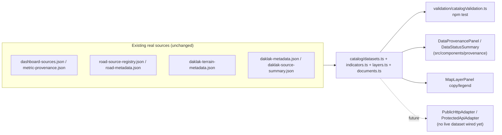

# Data platform architecture

`src/data-platform/` turns scattered-but-real provenance (already present in
`metric-provenance.json`, `road-source-registry.json`, `daklak-terrain-metadata.json`,
`daklak-source-summary.json`) into one typed, queryable catalog. It wraps the existing data — it
does not replace `src/data/datasetManifest.ts` or any GIS artifact, and the GIS pipeline
(`scripts/*.py`, [docs/data-provenance.md](data-provenance.md)) is unchanged.

```text
src/data-platform/
  schemas/     TypeScript shapes only (DatasetDescriptor, IndicatorDefinition/Observation,
               MapLayerDescriptor, DataAccessPolicy, UserContext, AuditEvent, DocumentReference)
  catalog/     The actual data: DATASET_CATALOG, INDICATOR_DEFINITIONS/OBSERVATIONS,
               LAYER_REGISTRY, DOCUMENT_REFERENCES, plus freshness.ts (computeFreshness/
               summarizeDataStatus)
  adapters/    DatasetAdapter<T> + BundledStaticAdapter/PublicHttpAdapter/ProtectedApiAdapter/
               PmtilesSourceAdapter — see docs/internal-data-integration.md
  policies/    DEFAULT_ACCESS_POLICIES + canViewDataset/canExportDataset/canCacheDataset
  validation/  catalogValidation.ts — the TS-level equivalent of
               scripts/validate_daklak_data.py, run via `npm test`
```

## Data flow



## Why the catalog, not a rewrite

`AGENTS.md` says not to replace working architecture without need. The existing dashboard already
had real provenance fields scattered across several JSON files and a working
`datasetManifest.ts`/Zustand store — the gap was that nothing _typed_ or _classified_ them
consistently, and nothing enforced "public bundle never gets non-public data." The catalog closes
that gap without a rewrite:

- `datasetManifest.ts` is untouched; `catalog/datasets.ts` wraps the same underlying JSON.
- `mapStore.ts`'s `detailMapLayers`/`roadsVisible` fields are untouched; `catalog/layers.ts` only
  supplies display copy/legend to `MapLayerPanel`, which still owns its own toggle mechanics.
- No new runtime dependency was added (no Zod, no ts-node/tsx) — validation and JSON Schema
  templates are hand-written, matching how `scripts/validate_daklak_data.py` and
  `src/data/datasetManifest.ts`'s `validateDatasetArtifacts` already work in this repo.

## Where the public-bundle leakage guard lives

Spec-mandated invariant: a dataset with `access.delivery: 'bundled-static'` must have
`classification: 'public'`. This is enforced in `validateCatalog()`
(`src/data-platform/validation/catalogValidation.ts`), asserted against the real catalog via the
module-level `catalogValidationIssues` constant and a test that requires it to equal `[]` — the
same pattern `datasetManifestIssues` already uses. This runs under `npm test` (already part of
`quality:frontend`), so a regression fails CI without a second, separately-maintained Node script.

## Adding a dataset, indicator, layer, or document reference

See [docs/dataset-onboarding.md](dataset-onboarding.md) for the concrete steps.
