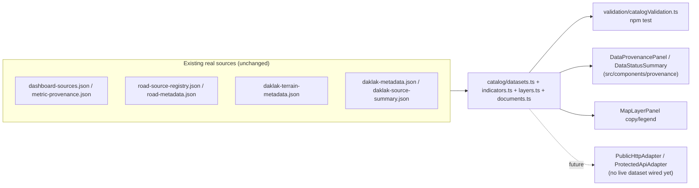

# Data platform architecture

`src/data-platform/` turns scattered-but-real provenance (already present in
`metric-provenance.json`, `road-source-registry.json`, `daklak-terrain-metadata.json`,
`daklak-source-summary.json`) into one typed, queryable catalog. It wraps the existing data — it
does not replace `src/data/datasetManifest.ts` or any GIS artifact, and the GIS pipeline
(`scripts/*.py`, [docs/data-provenance.md](data-provenance.md)) is unchanged.

```text
src/data-platform/
  schemas/     TypeScript shapes only (DatasetDescriptor, IndicatorDefinition/Observation,
               MapLayerDescriptor, DataAccessPolicy, UserContext, AuditEvent, DocumentReference)
  catalog/     The actual data: DATASET_CATALOG, INDICATOR_DEFINITIONS/OBSERVATIONS,
               LAYER_REGISTRY, DOCUMENT_REFERENCES, plus freshness.ts (computeFreshness/
               summarizeDataStatus)
  adapters/    DatasetAdapter<T> + BundledStaticAdapter/PublicHttpAdapter/ProtectedApiAdapter/
               PmtilesSourceAdapter — see docs/internal-data-integration.md
  policies/    DEFAULT_ACCESS_POLICIES + canViewDataset/canExportDataset/canCacheDataset
  validation/  catalogValidation.ts — the TS-level equivalent of
               scripts/validate_daklak_data.py, run via `npm test`
```

## Data flow



## Why the catalog, not a rewrite

`AGENTS.md` says not to replace working architecture without need. The existing dashboard already
had real provenance fields scattered across several JSON files and a working
`datasetManifest.ts`/Zustand store — the gap was that nothing _typed_ or _classified_ them
consistently, and nothing enforced "public bundle never gets non-public data." The catalog closes
that gap without a rewrite:

- `datasetManifest.ts` is untouched; `catalog/datasets.ts` wraps the same underlying JSON.
- `mapStore.ts`'s `detailMapLayers`/`roadsVisible` fields are untouched; `catalog/layers.ts` only
  supplies display copy/legend to `MapLayerPanel`, which still owns its own toggle mechanics.
- No new **production** dependency was added (no Zod, no ts-node/tsx) — validation and JSON Schema
  templates are hand-written, matching how `scripts/validate_daklak_data.py` and
  `src/data/datasetManifest.ts`'s `validateDatasetArtifacts` already work in this repo. `ajv`/
  `ajv-formats` were added as **devDependencies only**, used exclusively by
  `schemaDriftGuard.test.ts` (see "Schema drift guard" below) — never imported by any file reachable
  from `src/main.tsx`, which `validate:public-build` verifies.

## Where the public-bundle leakage guard lives

Spec-mandated invariant: a dataset with `access.delivery: 'bundled-static'` must have
`classification: 'public'`. Two independent layers enforce it:

1. `validateCatalog()` (`src/data-platform/validation/catalogValidation.ts`), asserted against the
   real catalog via the module-level `catalogValidationIssues` constant and a test that requires it
   to equal `[]` — the same pattern `datasetManifestIssues` already uses. Runs under `npm test`.
2. `scripts/validate_public_build.mjs` (`npm run validate:public-build` / `:dist`) — catches a
   developer bypassing the catalog with a raw import, or leaking something private into the actual
   built bundle. See [docs/security-architecture.md](security-architecture.md#public-data-leakage-boundary)
   for the full breakdown; fixture tests live in `scripts/validate_public_build.test.mjs`.

## Lazy loading

`DetailMapViewport` and `DataProvenancePanel` are both `React.lazy` boundaries in `App.tsx` — a
visitor who never opens the detail map or the provenance panel never downloads either chunk. The
provenance panel's open/closed state is a plain `provenancePanelOpen: boolean` in `mapStore.ts`
(not an event-signal counter) specifically so this works without a race: the boolean already lives
in the always-loaded store the moment the trigger button is clicked, so `App.tsx` can gate
`{provenancePanelOpen && <Suspense>...}` correctly even before the lazy chunk resolves — a
counter-based "have I seen this value" ref, by contrast, only starts existing once the lazy
component itself has mounted, so a click that fires before the chunk loads would be silently
missed. `DetailMapViewport` focuses its own root element on mount instead of relying on `App.tsx`'s
view-change effect, for the same underlying reason (see the code comments in both files).

## Schema drift guard

`data-templates/schemas/*.schema.json` are hand-written JSON Schema, kept in sync with
`src/data-platform/schemas/*.ts` **by hand** — nothing auto-generates one from the other.
`src/data-platform/validation/schemaDriftGuard.ts` is a second, independent hand-written TS mirror
of the same constraints; `schemaDriftGuard.test.ts` compiles the real JSON Schema files with Ajv
(dev-only dependency) and runs both validators over the same fixtures in
`data-templates/fixtures/{valid,invalid}/`, failing if they ever disagree on any fixture. This
doesn't prevent drift — it detects it the moment someone changes one representation without the
other.

## Adding a dataset, indicator, layer, or document reference

See [docs/dataset-onboarding.md](dataset-onboarding.md) for the concrete steps.
