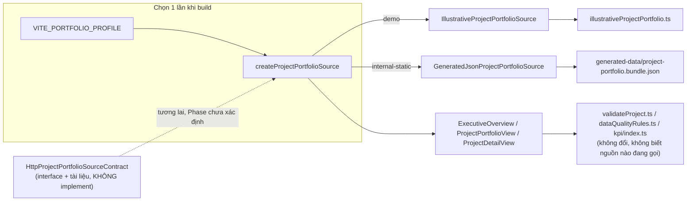

# Target architecture — data-access boundary & composition root (Phase 1 design)

Trạng thái: **Phase 2 đã triển khai** (xem [ADR 0005](../adr/0005-project-portfolio-source-abstraction.md)
cho quyết định cuối + 2 sai lệch phát hiện khi implement, tóm tắt ngay dưới đây). Phần còn lại của
tài liệu này là bản gốc Phase 1, giữ nguyên làm hồ sơ thiết kế — đọc cùng ADR 0005 để biết chỗ nào đã
đổi.

## Sai lệch phát hiện khi triển khai Phase 2 (so với bản thiết kế Phase 1 dưới đây)

1. **`getMetadata()` — mục 1 dưới đây quyết định KHÔNG thêm method này, cuối cùng VẪN thêm.** Lý do
   Phase 1 nêu ra (rủi ro race giữa hai lần gọi độc lập) chỉ áp dụng cho một nguồn HTTP có network —
   cả hai implementation Phase 2 đều 100% static, không có rủi ro đó. `getMetadata()` đồng bộ còn là
   cách DUY NHẤT biết nguồn nào đang chạy khi `loadPortfolio()` trả `status: 'error'` (không có
   `data`). Đã thêm, embedded metadata trong `ProjectPortfolioLoadResult.data` vẫn giữ như thiết kế
   gốc (không mâu thuẫn, hai cơ chế bổ sung nhau).
2. **Composition root ở mục 3 dùng `switch` runtime — KHÔNG đủ để tree-shake.** Build thật
   (`npm run build:internal-static`) rồi grep `dist/assets/*.js` cho thấy dữ liệu minh hoạ
   (`illustrativeProjectPortfolio.ts`) vẫn có mặt trong bundle dù chỉ nhánh `internal-static` chạy —
   Rollup không chứng minh được nhánh nào chết vì giá trị mode đi qua một hàm resolve trung gian.
   Đã sửa bằng `resolve.alias` của Vite (chọn module theo `--mode` CLI tại build-config time, không
   phải runtime), buộc Rollup chỉ thấy MỘT module nguồn — xem
   [ADR 0005](../adr/0005-project-portfolio-source-abstraction.md) quyết định 3 để biết chi tiết cơ
   chế và bằng chứng build thật.

Ngoài hai điểm trên, thiết kế Phase 1 dưới đây khớp với triển khai thật.

## 1. Quyết định: mở rộng `ProjectPortfolioSource` hiện có, không tạo interface mới

Yêu cầu gốc đề xuất:

```ts
export interface ProjectPortfolioSource {
  load(): Promise<ProjectPortfolioBundle>;
  getMetadata(): ProjectPortfolioSourceMetadata;
}
```

Interface **đã tồn tại** tại `src/entities/project/adapters/ProjectPortfolioSource.ts`:

```ts
export interface ProjectPortfolioSource {
  loadPortfolio(signal?: AbortSignal): Promise<ProjectPortfolioLoadResult>;
}
```

**Quyết định: giữ nguyên `loadPortfolio(signal?)`, không đổi tên, không thêm `getMetadata()` như một
method riêng.** Lý do:

1. `loadPortfolio()` đã được gọi từ 3 view + test + `FakeProjectPortfolioSource`. Đổi tên là breaking
   change không cần thiết cho một cải tiến thuần cộng thêm.
2. `ProjectPortfolioLoadResult` hiện đã tốt hơn interface đề xuất — nó phân biệt `ok`/`degraded`/
   `error` thay vì luôn resolve hoặc luôn throw. Interface mới không được làm mất khả năng này.
3. Một method `getMetadata()` tách rời có rủi ro **mô tả một lần load khác** với lần `load()` gần
   nhất (race giữa hai lời gọi độc lập, đặc biệt với nguồn HTTP tương lai). An toàn hơn: metadata đi
   kèm **trong cùng một kết quả** của `loadPortfolio()`.

Thay đổi cụ thể (additive, Phase 2):

```ts
export interface ProjectPortfolioBundleMetadata {
  /** Version của wire-format bundle (khác DatasetDescriptor.version — đây là version của CẤU TRÚC
   * JSON bundle, tăng khi schema bundle đổi không tương thích ngược). */
  bundleVersion: string;
  /** Điểm neo nghiệp vụ "số liệu tính đến ngày nào" — deterministic, đến từ importer/fixture, không
   * phải Date.now(). Tách biệt khỏi 4 mốc trong ProjectPortfolioProvenance (không thay thế). */
  asOf: string;
  /** Với GeneratedJsonProjectPortfolioSource: thời điểm importer chạy. Với
   * IllustrativeProjectPortfolioSource: undefined (không có "lần import" — dữ liệu được viết tay). */
  importedAt?: string;
  /** SHA-256 của bundle JSON (stable-serialize) — cho phép Data Readiness UI hiển thị và người vận
   * hành đối chiếu hai bản build. */
  checksum?: string;
  /** Nguồn nào đang cung cấp dữ liệu — cho Data Readiness UI, không dùng để rẽ nhánh logic nghiệp vụ
   * (component không được switch theo sourceKind — xem mục 4). */
  sourceKind: 'illustrative' | 'generated-json' | 'http';
  /** Số dataset gốc góp phần vào bundle này (đếm distinct sourceDatasetId trong toàn bundle). */
  datasetCount: number;
}

export interface ProjectPortfolio {
  bundles: readonly ProjectBundle[];
  validAdministrativeCodes: ReadonlySet<string>;
  provenance: ProjectPortfolioProvenance; // giữ nguyên, không đổi
  metadata: ProjectPortfolioBundleMetadata; // MỚI
}
```

`ProjectPortfolioProvenance` (4 mốc effectiveAt/sourcePublishedAt/retrievedAt/publishedToDashboardAt/
loadedInBrowserAt) **giữ nguyên không đổi** — nó mô tả một snapshot cụ thể đã tồn tại, trong khi
`ProjectPortfolioBundleMetadata` mô tả _bản thân bundle như một artifact_ (version, checksum, nguồn).
Hai khái niệm khác nhau, không gộp để tránh lặp lại sai lầm "loadedAt bị dùng lẫn lộn" mà comment
trong file gốc đã cảnh báo.

## 2. Ba implementation

### 2.1 `IllustrativeProjectPortfolioSource` (đổi tên từ `BundledProjectPortfolioSource`)

- Đổi tên vì sau khi có `GeneratedJsonProjectPortfolioSource`, tên "Bundled" không còn phân biệt được
  hai nguồn — cả hai đều là static import trong nghĩa Vite. "Illustrative" khớp đúng ngữ nghĩa yêu
  cầu và khớp với tên biến `MOCK_*`/nhãn "dữ liệu minh hoạ" đã dùng khắp repo.
- Hành vi giữ nguyên 100%: bọc `MOCK_PROJECT_BUNDLES`, luôn trả `status: 'ok'`.
- `metadata`: `{ bundleVersion: '<hardcoded, vd "illustrative-1">', asOf: MOCK_REFERENCE_DATE,
importedAt: undefined, checksum: undefined, sourceKind: 'illustrative', datasetCount: 3 }`.
- Đổi tên file/class là thay đổi mã nguồn thật → thuộc Phase 2, **không làm ở Phase 1**. Đề xuất giữ
  một type alias `BundledProjectPortfolioSource` tạm thời (deprecated re-export) nếu có code ngoài 3
  view gọi trực tiếp tên cũ, để không phá import path hiện có trong một lần đổi.

### 2.2 `GeneratedJsonProjectPortfolioSource`

- Đọc `generated-data/project-portfolio.bundle.json` (output của importer — xem
  03-importer-design.md) bằng static `import` (Vite bundles nó vào chunk riêng cho build
  `internal-static`) — **không fetch qua network**, đây vẫn là static bundling, chỉ khác nguồn file.
- Validate tối thiểu khi load: `schemaVersion`/`bundleVersion` đúng định dạng mong đợi, cấu trúc top
  cấp đúng shape `ProjectPortfolioBundle` (đã được importer validate kỹ trước đó — đây chỉ là
  defensive check, không lặp lại toàn bộ validation).
- Nếu file bundle thiếu hoặc hỏng cấu trúc: trả `status: 'error'`, `kind: 'source-unavailable'` hoặc
  `'schema-invalid'` — **không** fallback âm thầm về illustrative data (fallback ngầm sẽ khiến người
  vận hành tưởng nhầm dữ liệu thật đang hiển thị).
- `metadata.sourceKind: 'generated-json'`, các field còn lại đọc trực tiếp từ `import-manifest.json`
  đã được importer sinh ra và đóng gói cùng bundle.

### 2.3 `HttpProjectPortfolioSourceContract`

- **Chỉ là interface + tài liệu**, đúng như yêu cầu — không implementation, không gọi API giả.
- Kế thừa đúng convention `PublicHttpAdapter`/`ProtectedApiAdapter` đã có trong
  `src/data-platform/adapters/`: HTTPS-only, timeout + `AbortSignal`, không retry 4xx, schema-validate
  response, trả tagged-union thay vì throw.
- Đặt tại `src/entities/project/adapters/HttpProjectPortfolioSourceContract.ts`, nội dung chủ yếu là
  type + JSDoc trỏ về "API contract gate" đã ghi trong domain-model.md (JSON Schema DTO có version +
  mapper DTO→domain tường minh + contract test) — nhắc lại đúng 3 điều kiện đó, không thêm điều kiện
  mới.
- Không triển khai trong bất kỳ phase nào của backlog hiện tại (Phase 2-6) trừ khi có yêu cầu mới —
  đúng tinh thần "không làm thay đổi lớn chỉ để chuẩn bị cho backend chưa tồn tại".

## 3. Composition root

**Vấn đề hiện tại**: `ExecutiveOverview.tsx`, `ProjectPortfolioView.tsx`, `ProjectDetailView.tsx` mỗi
view tự `source ?? new BundledProjectPortfolioSource()` độc lập.

**Đề xuất Phase 2**: thêm một hàm factory tập trung, ví dụ `src/app/createProjectPortfolioSource.ts`:

```ts
export type PortfolioProfile = 'demo' | 'internal-static';
// 'http' cố ý không có nhánh — HttpProjectPortfolioSourceContract chưa implement.

export function createProjectPortfolioSource(
  profile: PortfolioProfile = resolveProfileFromBuildEnv(),
): ProjectPortfolioSource {
  switch (profile) {
    case 'demo':
      return new IllustrativeProjectPortfolioSource();
    case 'internal-static':
      return new GeneratedJsonProjectPortfolioSource();
  }
}
```

- `resolveProfileFromBuildEnv()` đọc một biến build-time (Vite `import.meta.env`, xem
  04-deployment-profiles-design.md) — **được tính một lần ở compile/build time**, không phải runtime
  toggle trong UI (tránh một bundle chứa cả hai nguồn dữ liệu cùng lúc, phá mục tiêu "internal-static
  không được bundle dữ liệu minh hoạ").
- 3 view đổi từ `source ?? new BundledProjectPortfolioSource()` sang
  `source ?? createProjectPortfolioSource()` — thay đổi tối thiểu, giữ nguyên khả năng inject
  `FakeProjectPortfolioSource` qua prop cho test (không đổi cơ chế test hiện có).
- Đây là thay đổi mã nguồn thật → **Phase 2**, không làm ở Phase 1.

## 4. Ràng buộc cho component/KPI/domain (nhắc lại, không đổi)

- Không component, KPI, hay hàm domain nào được kiểm tra `metadata.sourceKind` để rẽ nhánh hiển thị
  nghiệp vụ (KPI/business alert) — `sourceKind` chỉ dùng cho Data Readiness UI (hiển thị "nguồn nào
  đang chạy"), không phải điều kiện logic. Nếu một component cần biết "đây là dữ liệu minh hoạ hay
  không" để hiển thị banner, dùng field đã có sẵn ở cấp dataset (`DatasetDescriptor.authority ===
'illustrative'`), không dùng `sourceKind` của bundle.
- Domain layer (`src/entities/project/`) tiếp tục **không import** bất kỳ adapter/source nào —
  `importBoundary.test.ts` phải được mở rộng để cấm import `adapters/*Source*.ts` từ trong
  `validation/`, `kpi/`, `*.ts` domain thuần (xem 05-implementation-backlog.md).

## 5. Sơ đồ luồng dữ liệu mục tiêu


