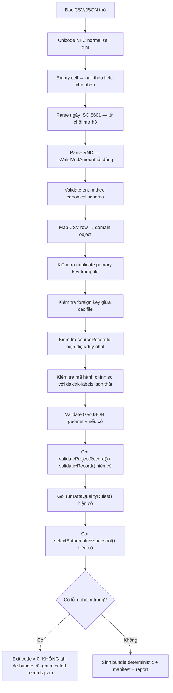

# Importer CLI design (Phase 1 design)

Trạng thái: **đề xuất, chưa triển khai**. Không có script nào được tạo trong Phase 1.

## 1. Nguyên tắc thiết kế quan trọng nhất: importer KHÔNG viết lại business rule

Importer chỉ làm hai việc mà chưa ai làm: **(a)** đọc CSV/JSON thô, chuyển sang canonical domain
object; **(b)** kiểm tra các invariant chỉ có ý nghĩa ở lớp file thô (duplicate PK trong file, FK
tồn tại giữa các file, mã hành chính hợp lệ). Sau khi có `ProjectBundle[]` hợp lệ về mặt cấu trúc,
importer **gọi lại nguyên vẹn** `validateProjectRecord`/`validateWorkPackageRecord`/
`validateMilestoneRecord`/`validateProjectIssueRecord`/`validateProgressSnapshotRecord`
(`validateProject.ts`) và `runDataQualityRules()` (`dataQualityRules.ts`) và
`selectAuthoritativeSnapshot()` (`progressSnapshotSelection.ts`) — **import trực tiếp các hàm này từ
`src/entities/project/`**, không sao chép logic. Đây là cách duy nhất đảm bảo UI và importer không
bao giờ lệch nhau về "thế nào là dữ liệu hợp lệ".

Hệ quả kỹ thuật: importer là một Node script (`.mjs`, giống `scripts/data-refresh/*.mjs`) nhưng phải
**import được TypeScript của `src/entities/project/`**. Hai lựa chọn:

- **(A)** Biên dịch `src/entities/project/{types,validation,kpi}` sang một thư mục `dist-domain/`
  qua `tsc` riêng (không kéo theo React/Vite), importer `.mjs` import từ đó.
- **(B)** Dùng Vite's `ssrLoadModule` giống cách `scripts/generate_public_manifest.mjs` đã làm với
  `publicManifest.ts` (đã có tiền lệ trong repo, không thêm dependency `ts-node`/`tsx`).

**Đề xuất: (B)**, đúng tiền lệ `generate_public_manifest.mjs` đã dùng, tránh thêm bước build riêng
và tránh thêm dependency. Cần xác nhận `src/entities/project/validation/*.ts` không import bất kỳ
thứ gì cần DOM/browser (đã đúng theo `importBoundary.test.ts` — domain layer vốn đã bị cấm import
React/component/CSS).

## 2. Lệnh và flag

```bash
npm run import:data -- --input ./incoming-data --output ./generated-data \
  [--dry-run] [--as-of=2026-07-27] [--strict]
```

| Flag        | Bắt buộc                            | Hành vi                                                                                                                                                                                                                                                                                          |
| ----------- | ----------------------------------- | ------------------------------------------------------------------------------------------------------------------------------------------------------------------------------------------------------------------------------------------------------------------------------------------------ |
| `--input`   | Có                                  | Thư mục chứa CSV/JSON theo canonical schema (02-canonical-schema-proposal.md)                                                                                                                                                                                                                    |
| `--output`  | Có                                  | Thư mục ghi `generated-data/*` (mục 5)                                                                                                                                                                                                                                                           |
| `--dry-run` | Không                               | Chạy toàn bộ pipeline, ghi report, **không** ghi/ghi-đè bundle thật                                                                                                                                                                                                                              |
| `--as-of`   | Khuyến nghị bắt buộc khi `--strict` | ISO 8601 date, điểm neo nghiệp vụ cho mọi tính toán stale/overdue. Không có → dùng thời điểm chạy thật (`new Date()`), in cảnh báo rõ ràng ra stderr và ghi `asOfSource: 'wall-clock-fallback'` vào manifest — để không chặn chạy thử thủ công nhanh, nhưng không bao giờ giấu việc đã fallback. |
| `--strict`  | Không                               | Nâng mọi warning (data-quality issue) thành lỗi chặn exit code ≠ 0. Dùng cho build `internal-static` trong CI — không dùng cho chạy thử thủ công lần đầu.                                                                                                                                        |

## 3. Các giai đoạn (mirror kiến trúc staged-pipeline của `scripts/data-refresh/run.mjs`, khác nội dung)



## 4. Chi tiết từng bước dễ sai

- **Unicode normalize**: `.normalize('NFC')` cho mọi trường string trước khi so sánh/hash — tên tiếng
  Việt có thể nhập ở cả NFC và NFD tuỳ nguồn (Excel trên các máy khác nhau xuất khác nhau); không
  normalize sẽ khiến hai bản ghi "giống hệt mắt thường" bị coi là khác nhau ở bước duplicate-check.
- **Ngày mơ hồ bị từ chối, không đoán**: chỉ chấp nhận `YYYY-MM-DD` (và `YYYY-MM-DDTHH:mm:ssZ` cho
  field datetime). `01/02/2026` bị từ chối thẳng (không đoán là DD/MM hay MM/DD) — lỗi ghi rõ
  "ambiguous-date-format" kèm giá trị gốc, dòng, cột.
- **VND**: gọi `isValidVndAmount` — cần **export** hàm này khỏi `validateProject.ts` trước (hiện đang
  private); đây là thay đổi 1 dòng (`function` → `export function`), không đổi logic, thuộc Phase 4.
- **Mã hành chính**: importer phải dùng **đúng nguồn thật** `daklak-labels.json` (qua GIS pipeline
  hiện có), **không** tự tạo danh sách mã hành chính riêng — nếu không, importer và
  `BundledProjectPortfolioSource`/`GeneratedJsonProjectPortfolioSource` có thể chấp nhận hai tập mã
  khác nhau, một invariant hiện tại (`validAdministrativeCodes`) sẽ bị vi phạm âm thầm.
- **Geometry**: dùng cùng validator hình học đã có (`isValidProjectGeometry` trong
  `validateProject.ts`) — không viết validator GeoJSON song song. Nếu Phase 3 thêm LineString vào
  `ProjectGeometry`, `isValidProjectGeometry` phải được mở rộng **một chỗ**, importer tự động hưởng
  lợi vì gọi lại hàm đó.
- **Không âm thầm sửa dữ liệu sai**: nếu một cell không parse được (ngày mơ hồ, VND có phần thập
  phân, enum lạ), importer **không** đoán giá trị gần đúng hay tự làm tròn — luôn từ chối record đó
  làm lỗi, liệt vào `rejected-records.json`.

## 5. Output

```text
generated-data/
  project-portfolio.bundle.json   # ProjectPortfolioBundleFile, xem 02-canonical-schema-proposal.md §5
  import-manifest.json            # xem mục 6
  validation-report.json          # lỗi block build: file, dòng, field, giá trị, rule vi phạm
  quality-report.json             # warning không block: kết quả runDataQualityRules() serialize
  rejected-records.json           # record bị từ chối hoàn toàn (không vào bundle), kèm lý do
  import-summary.md               # tóm tắt người đọc được — số liệu chính + link 4 file trên
```

`validation-report.json` — mỗi entry tối thiểu:

```json
{
  "file": "projects.csv",
  "line": 42,
  "field": "approvedBudget",
  "value": "15000000.50",
  "rule": "vnd-must-be-integer",
  "severity": "error"
}
```

## 6. `import-manifest.json`

```ts
interface ImportManifest {
  schemaVersion: string;
  bundleVersion: string;
  generatedAt: string; // thời điểm ghi file — không phải asOf
  asOf: string;
  asOfSource: 'flag' | 'wall-clock-fallback';
  sourceFiles: string[]; // đường dẫn TƯƠNG ĐỐI so với --input, không có đường dẫn máy cá nhân
  sourceFileChecksums: Record<string, string>; // sha256 mỗi file input — tái dùng scripts/data-refresh/checksum.mjs
  recordCounts: Record<string, number>; // theo dataset id
  acceptedCounts: Record<string, number>;
  rejectedCounts: Record<string, number>;
  warningCounts: Record<string, number>;
  datasetIds: string[]; // resolve qua DATASET_CATALOG, giống Phase 1.5 đã làm cho fixture
  administrativeCodeVersion: string; // version/checksum của daklak-labels.json đã dùng để validate
  importerVersion: string; // đọc từ package.json "version", không hardcode
}
```

Không chứa: đường dẫn tuyệt đối máy cá nhân (chỉ ghi path tương đối so với `--input`/`--output`),
nội dung dữ liệu nhạy cảm (manifest chỉ có số đếm và checksum, không có tên/số liệu thật).

## 7. Exit code & last-known-good protection

- Có lỗi nghiêm trọng (validation error, không phải quality warning) → **exit code khác 0**.
- Khi exit code khác 0: importer ghi vào một thư mục **staging** (`--output/.staging/` hoặc tương
  tự), **không** đụng tới `project-portfolio.bundle.json` đã có ở `--output` từ lần chạy trước —
  atomically chỉ `rename()` staging → output khi toàn bộ pipeline thành công (không có lỗi chặn).
  `--dry-run` không bao giờ tới bước rename, kể cả khi không có lỗi.
- Warning (data-quality issue) không chặn exit code 0, nhưng luôn xuất hiện trong `quality-report.json`
  và tổng số được in ra summary — im lặng bỏ qua warning không được chấp nhận.

## 8. Test plan (mirror `docs/testing-strategy.md`, không phát minh convention mới)

- **Unit test thuần** (không cần fixture file): CSV parser edge case (dấu phẩy trong quoted field, BOM
  UTF-8, dòng trống cuối file), date parser (chấp nhận `YYYY-MM-DD`, từ chối mọi biến thể khác), VND
  parser (số âm, số thập phân, vượt `MAX_SAFE_INTEGER`), Unicode normalize (NFD → NFC), empty→null
  coercion theo field optional/required.
- **Integration test** chạy importer thật trên `data-templates/examples/` (thư mục ví dụ input hợp
  lệ) → so khớp byte-for-byte với `data-templates/expected-output/` (golden file) — bất kỳ thay đổi
  logic importer nào làm lệch output phải cập nhật golden file một cách **có chủ đích** (giống quy
  tắc "không update Playwright baseline chỉ để test xanh" trong AGENTS.md, áp dụng tương tự ở đây).
- **Deterministic-output test**: chạy importer 2 lần trên cùng input + cùng `--as-of` → assert hai
  file `project-portfolio.bundle.json` giống hệt nhau ngoại trừ `generatedAt` (thời điểm ghi file).
- **Last-known-good protection test**: input cố ý có 1 record lỗi nghiêm trọng → assert exit code ≠
  0 và file `generated-data/project-portfolio.bundle.json` (đã có từ trước, giả lập) **không đổi nội
  dung/mtime**.
- **Import failure behavior test**: mỗi loại lỗi (duplicate PK, FK treo, mã hành chính lạ, ngày mơ
  hồ, VND không nguyên, enum sai, geometry invalid) có ít nhất 1 fixture invalid tương ứng trong
  `data-templates/fixtures/project-domain/invalid/`, assert đúng `rule` xuất hiện trong
  `validation-report.json`.
- **Architecture/boundary test** (theo convention `importBoundary.test.ts`): importer script không
  được định nghĩa lại bất kỳ business rule nào đã có — test tĩnh kiểm tra importer thực sự
  `import { validateProjectRecord, runDataQualityRules, selectAuthoritativeSnapshot } from
'../../src/entities/project/...'` thay vì có bản sao logic tương tự trong `scripts/import-data/`.

## 9. Việc KHÔNG làm

- Không gọi network trong importer (100% offline, đọc file local).
- Không thêm dependency production (CSV parser là devDependency-only, giống `ajv`).
- Không sửa `validateProject.ts`/`dataQualityRules.ts` để "dễ gọi từ importer hơn" trừ việc export
  `isValidVndAmount` (đổi tối thiểu, không đổi logic).
- Không tự động sửa dữ liệu sai để build "xanh" — mọi lỗi phải dừng build hoặc rơi vào
  `rejected-records.json`, không có chế độ "best-effort import".
