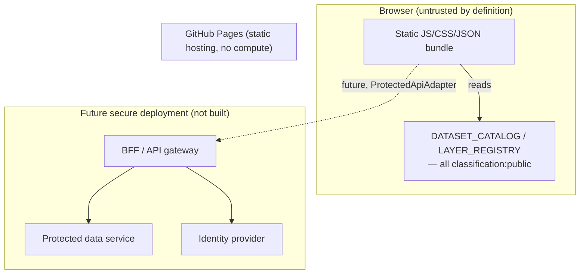

# Security architecture (data platform additions)

This extends [SECURITY.md](../SECURITY.md) — read that first for the existing CSP/CI/reporting
policy, which is unchanged. This document covers what the data-platform layer adds.

## Trust boundaries today

Everything inside "Browser" must be assumed fully readable by anyone — there is no secret in a
static bundle that stays secret. The only trust boundary that currently exists in this repository
is: **public data goes in the bundle; everything else does not.**

## Data that must never reach the frontend bundle

- Any dataset with `classification` other than `public` (enforced by `validateCatalog`'s leakage
  check — see [docs/data-classification.md](data-classification.md)).
- Access tokens, session cookies values, API keys, or database/service credentials of any kind —
  none exist in this repo today because there is no backend.
- Internal hostnames/URLs not meant for public resolution.
- Any future `ProtectedApiAdapter` response body — logged nowhere client-side
  (`ProtectedApiAdapter.load` deliberately never `console.log`s the parsed JSON).

## CSP

Unchanged mechanism from [SECURITY.md](../SECURITY.md) (meta-tag CSP, since GitHub Pages can't set
response headers). The data platform introduces no new network origin — `PublicHttpAdapter`
enforces HTTPS in code, but no live dataset is wired to fetch from an external host yet. If one
ever is, `connect-src` in `index.html`'s CSP must add that origin first (same rule already
documented there for the detail map's PMTiles source).

## Secret scanning

`scripts/check_secrets.mjs` now also matches JWTs (`eyJ...`.`...`.`...`) and literal `Bearer <token>`
values, in addition to the existing private-key/GitHub-token/AWS-key patterns. Verified against
all currently tracked files with zero false positives before merging (`node
scripts/check_secrets.mjs`).

## Threat model (practical, not exhaustive)

| Threat                                               | Mitigation                                                                                 | Residual risk                                                                                                                                                                                                               |
| ---------------------------------------------------- | ------------------------------------------------------------------------------------------ | --------------------------------------------------------------------------------------------------------------------------------------------------------------------------------------------------------------------------- |
| A non-public dataset accidentally gets bundled       | `validateCatalog` leakage check fails `npm test`                                           | Only catches datasets _already in_ `DATASET_CATALOG` — a developer importing raw JSON directly, bypassing the catalog, isn't caught. Mitigation: code review + `AGENTS.md`'s "dataset metadata source of truth" convention. |
| A future protected API leaks a token via URL/logs    | `ProtectedApiAdapter` uses header auth, never query-string; never logs response body       | Query-string tokens for genuinely short-lived _signed_ URLs (e.g. a future signed PMTiles URL) are explicitly allowed by spec §12 — `PmtilesSourceAdapter.expiresAt` models this, but no signing service exists yet.        |
| Secret committed to the repo                         | `check_secrets.mjs` in CI                                                                  | Pattern-based; a truly novel secret format could slip through. Revoke+rotate is still the real fix per [SECURITY.md](../SECURITY.md).                                                                                       |
| Frontend "access control" mistaken for real security | Explicit doc comments on every `canView/canExport/canCacheDataset` function; this document | Depends on future developers reading these docs before adding a protected dataset.                                                                                                                                          |

## Never claimed

This document does not claim legal/regulatory compliance (Luật Dữ liệu 60/2024/QH15, personal data
protection rules, or state-secret protection law) — those require a human compliance review against
the actual deployment and data involved, not a technical document. See
[docs/data-governance.md](data-governance.md).
