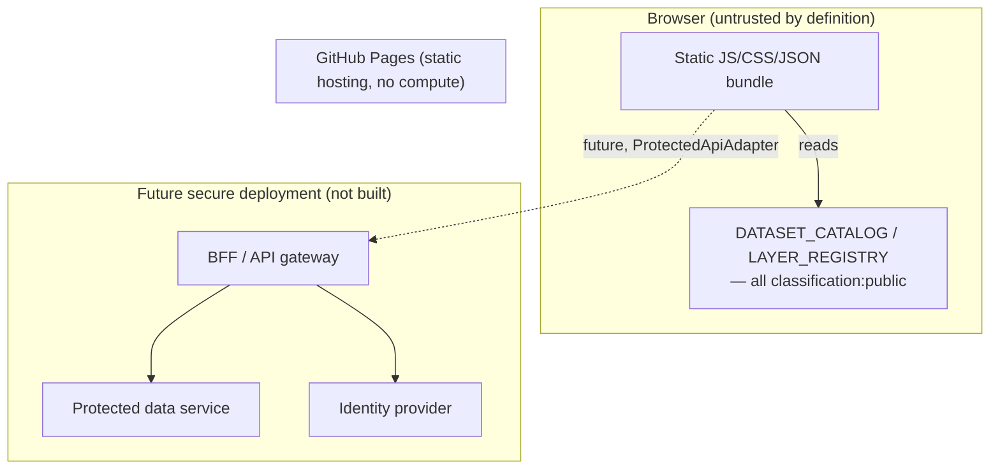

# Security architecture (data platform additions)

This extends [SECURITY.md](../SECURITY.md) — read that first for the existing CSP/CI/reporting
policy, which is unchanged. This document covers what the data-platform layer adds.

## Trust boundaries today

Everything inside "Browser" must be assumed fully readable by anyone — there is no secret in a
static bundle that stays secret. The only trust boundary that currently exists in this repository
is: **public data goes in the bundle; everything else does not.**

## Data that must never reach the frontend bundle

- Any dataset with `classification` other than `public` (enforced by `validateCatalog`'s leakage
  check — see [docs/data-classification.md](data-classification.md)).
- Access tokens, session cookies values, API keys, or database/service credentials of any kind —
  none exist in this repo today because there is no backend.
- Internal hostnames/URLs not meant for public resolution.
- Any future `ProtectedApiAdapter` response body — logged nowhere client-side
  (`ProtectedApiAdapter.load` deliberately never `console.log`s the parsed JSON).
- User data the current visitor is not authorized to see — the browser must never receive it in
  the first place; hiding it in a layer/component that isn't rendered is not a substitute (see
  "Statements this repo commits to" below).

## Public-data leakage boundary

Two layers, because they catch different mistakes:

1. `catalogValidation.ts` (`npm test`) — catches a _registered_ dataset with a bad
   classification/delivery combination.
2. `scripts/validate_public_build.mjs` (`npm run validate:public-build` before build,
   `npm run validate:public-build:dist` after) — catches everything catalogValidation.ts
   structurally cannot see:
   - **Source scan**: forbidden path segments (`/internal/`, `/confidential/`, `/restricted/`,
     `/protected/`), JSON imports outside the public allowlist, imports from `data-templates/`,
     production files importing test fixtures, and whether `ProtectedApiAdapter` is reachable from
     `src/main.tsx` (the real public app shell).
   - **Dist scan**: greps the actual built `dist/` output for private hostnames (`localhost`,
     `.local`, `internal.`/`intranet.`, RFC1918/loopback IPs — each requiring a `://` scheme
     separator immediately before the match, since minified library code is otherwise full of
     incidental lookalikes like React Three Fiber's own `.internal.interaction` property), JWTs,
     `Bearer` tokens, credential-shaped query parameters, non-`http://json-schema.org`/`w3.org`
     `http://` URLs, data-template placeholder text, protected role names, and any dataset id a
     manifest (written by `npm test`, read from `reports/public-dataset-manifest.json`) says is
     non-public.

Both are wired into `.github/workflows/quality.yml` (`static-analysis` job for source-mode,
`build-and-budget` job for dist-mode, which downloads the manifest artifact from `unit-and-data`).
Fixture-based tests for the scanner itself live in
`scripts/validate_public_build.test.mjs` (temp-directory fixtures, not the real repo tree).

## CSP

Unchanged mechanism from [SECURITY.md](../SECURITY.md) (meta-tag CSP, since GitHub Pages can't set
response headers). The data platform introduces no new network origin — `PublicHttpAdapter`
enforces HTTPS in code, but no live dataset is wired to fetch from an external host yet. If one
ever is, `connect-src` in `index.html`'s CSP must add that origin first (same rule already
documented there for the detail map's PMTiles source).

## Secret scanning

`scripts/check_secrets.mjs` now also matches JWTs (`eyJ...`.`...`.`...`) and literal `Bearer <token>`
values, in addition to the existing private-key/GitHub-token/AWS-key patterns. Verified against
all currently tracked files with zero false positives before merging (`node
scripts/check_secrets.mjs`).

## Threat model (practical, not exhaustive)

| Threat                                               | Mitigation                                                                                 | Residual risk                                                                                                                                                                                                               |
| ---------------------------------------------------- | ------------------------------------------------------------------------------------------ | --------------------------------------------------------------------------------------------------------------------------------------------------------------------------------------------------------------------------- |
| A non-public dataset accidentally gets bundled       | `validateCatalog` leakage check fails `npm test`                                           | Only catches datasets _already in_ `DATASET_CATALOG` — a developer importing raw JSON directly, bypassing the catalog, isn't caught. Mitigation: code review + `AGENTS.md`'s "dataset metadata source of truth" convention. |
| A future protected API leaks a token via URL/logs    | `ProtectedApiAdapter` uses header auth, never query-string; never logs response body       | Query-string tokens for genuinely short-lived _signed_ URLs (e.g. a future signed PMTiles URL) are explicitly allowed by spec §12 — `PmtilesSourceAdapter.expiresAt` models this, but no signing service exists yet.        |
| Secret committed to the repo                         | `check_secrets.mjs` in CI                                                                  | Pattern-based; a truly novel secret format could slip through. Revoke+rotate is still the real fix per [SECURITY.md](../SECURITY.md).                                                                                       |
| Frontend "access control" mistaken for real security | Explicit doc comments on every `canView/canExport/canCacheDataset` function; this document | Depends on future developers reading these docs before adding a protected dataset.                                                                                                                                          |

## Statements this repo commits to

Explicit, not implied, because "the frontend hides it" is the single most common way a project
convinces itself it has security it doesn't:

- Frontend policy helpers (`canViewDataset`/`canExportDataset`/`canCacheDataset`) are a **UX
  control only** — they cannot stop anyone from reading the bundle or replaying a request.
- Real authorization for non-public data must be enforced by a **backend/BFF/API gateway**, never
  by the frontend alone.
- The browser must **never receive** data the current user isn't authorized to see — "fetch it but
  don't render it" is not a mitigation.
- A layer being hidden/toggled-off in the UI is **not** a protection mechanism for the data behind
  it.
- Minification is **not** a security boundary.
- Client-side encryption of "sensitive" data in a public static bundle is **not** a security
  boundary — the decryption key would have to ship in the same bundle.
- Protected data must never be written to `localStorage`, `IndexedDB`, or a service-worker cache.
- A protected API response, or a protected/signed PMTiles tile response, must never be cached by a
  service worker.
- Any future signed PMTiles URL must be **short-lived** (`PmtilesSourceAdapter.expiresAt` models
  this) — a permanent signed URL is equivalent to no access control at all.
- Exporting protected/confidential data must be authorized **server-side**; a client-side "export"
  button is UX only, same as view access.
- The `public` deployment profile must never contain `internal`/`confidential`/`restricted`
  payload — see the leakage boundary above.
- `restricted` data is **not suited to this project's static GitHub Pages deployment at all** — see
  [docs/deployment-profiles.md](deployment-profiles.md).

## Never claimed

This document does not claim legal/regulatory compliance (Luật Dữ liệu 60/2024/QH15, personal data
protection rules, or state-secret protection law) — those require a human compliance review against
the actual deployment and data involved, not a technical document. See
[docs/data-governance.md](data-governance.md).
